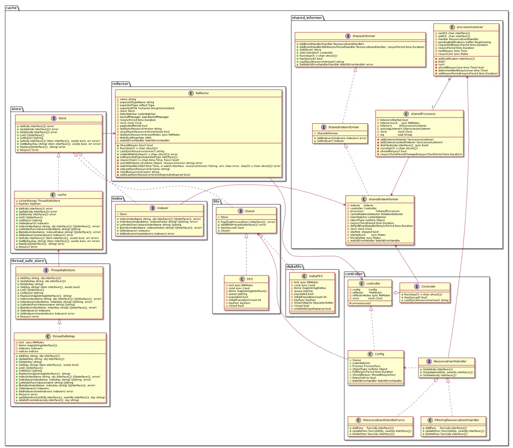

# kubernetes client-go informer学习总结
- [kubernetes client-go informer学习总结](#kubernetes-client-go-informer学习总结)
  - [概述](#概述)
    - [为什么要有informer?](#为什么要有informer)
    - [什么是informer？](#什么是informer)
  - [一图读懂informer](#一图读懂informer)
    - [2.1 Reflector](#21-reflector)
    - [2.2 DeltaFIFO](#22-deltafifo)
    - [2.3 Controller](#23-controller)
    - [2.4 sharedProcessor](#24-sharedprocessor)
    - [2.5 Indexer](#25-indexer)
  - [构建启动过程](#构建启动过程)
    - [3.1. 构建/初始化过程](#31-构建初始化过程)
      - [3.1.1 sharedInformerFactory的初始化](#311-sharedinformerfactory的初始化)
      - [3.1.2 sharedIndexInformer的初始化](#312-sharedindexinformer的初始化)
      - [3.1.3 注册ResourceEventHandler](#313-注册resourceeventhandler)
    - [3.2.启动过程](#32启动过程)
      - [3.2.1 启动sharedIndexFactory](#321-启动sharedindexfactory)
      - [3.2.2 启动sharedIndexInformer](#322-启动sharedindexinformer)
        - [3.2.2.1 初始化DeltaFIFO](#3221-初始化deltafifo)
        - [3.2.2.2 构建Config结构体](#3222-构建config结构体)
        - [3.2.2.3 构建controller结构体](#3223-构建controller结构体)
        - [3.2.2.4 s.processor.run](#3224-sprocessorrun)
        - [3.2.2.5 s.controller.Run](#3225-scontrollerrun)
          - [1. 创建Reflector](#1-创建reflector)
          - [2. Reflector Run](#2-reflector-run)
          - [3. s.HandleDeltas消费DeltaFIFO](#3-shandledeltas消费deltafifo)
    - [3.3 informer热身](#33-informer热身)
  - [Reflector源码分析](#reflector源码分析)
    - [4.1 ListerWatcher接口](#41-listerwatcher接口)
    - [4.2 ListerWatcher实现](#42-listerwatcher实现)
      - [4.2.1 client.CoreV1().ConfigMaps(namespace)获得configMaps结构体](#421-clientcorev1configmapsnamespace获得configmaps结构体)
      - [4.2.2 configMaps.List(context.TODO(), options)](#422-configmapslistcontexttodo-options)
      - [4.2.3 configMaps.Watch(context.TODO(), options)](#423-configmapswatchcontexttodo-options)
    - [4.3 r.ListAndWatch](#43-rlistandwatch)
      - [4.3.1 List操作--只执行一次](#431-list操作--只执行一次)
      - [4.3.2 Resync操纵--异步执行](#432-resync操纵--异步执行)
      - [4.3.3 Watch操作--循环执行](#433-watch操作--循环执行)
        - [4.3.3.1 r.listerWatcher.Watch(options)](#4331-rlisterwatcherwatchoptions)
        - [4.3.3.2 r.watchHandler(start, w, \&resourceVersion, resyncerrc, stopCh)](#4332-rwatchhandlerstart-w-resourceversion-resyncerrc-stopch)
  - [DeltaFIFO源码分析](#deltafifo源码分析)
    - [5.1 DeltaFIFO概述](#51-deltafifo概述)
    - [5.2 DeltaFIFO接口和实现](#52-deltafifo接口和实现)
    - [5.3 DeltaFIFO核心代码](#53-deltafifo核心代码)
      - [5.3.1 f.Add()](#531-fadd)
      - [5.3.2 f.queueActionLocked()](#532-fqueueactionlocked)
      - [5.3.2 f.Update()](#532-fupdate)
      - [5.3.3 f.Delete()](#533-fdelete)
      - [5.3.4 f.Replace()](#534-freplace)
      - [5.3.5 f.Pop()](#535-fpop)
      - [5.3.6 f.HasSynced()](#536-fhassynced)
      - [5.3.7 f.Resync()](#537-fresync)
        - [5.3.7.1 为什么要Resync呢？](#5371-为什么要resync呢)
        - [5.3.7.2 如何配置 resync 的周期](#5372-如何配置-resync-的周期)
  - [Indexer源码分析](#indexer源码分析)
    - [6.1 Indexer接口](#61-indexer接口)
    - [6.2 Indexer的实现--结构体cache](#62-indexer的实现--结构体cache)
      - [6.2.1 结构体cache](#621-结构体cache)
        - [6.2.1.1 ThreadSafeStore接口](#6211-threadsafestore接口)
        - [6.2.1.2 ThreadSafeStore的实现--threadSafeMap结构体](#6212-threadsafestore的实现--threadsafemap结构体)
        - [6.2.1.3 KeyFunc](#6213-keyfunc)
      - [6.2.2 cache的实例化过程](#622-cache的实例化过程)
    - [6.3 Indexer的索引结构](#63-indexer的索引结构)
      - [6.3.1 Indexers](#631-indexers)
      - [6.3.2 Indices](#632-indices)
    - [6.4 Indexer缓存写入](#64-indexer缓存写入)
      - [6.4.1 Indexer.Add](#641-indexeradd)
      - [6.4.2 Indexer.Update](#642-indexerupdate)
      - [6.4.4 Indexer.Delete](#644-indexerdelete)
      - [6.4.3 threadSafeMap.updateIndices](#643-threadsafemapupdateindices)
    - [6.5 Indexer缓存读取](#65-indexer缓存读取)
      - [6.5.1 根据索引读取资源对象](#651-根据索引读取资源对象)
      - [6.5.2 根据对象key直接读取](#652-根据对象key直接读取)
  - [引入WorkQueue](#引入workqueue)
  - [小知识](#小知识)
    - [wait.BackoffUntil](#waitbackoffuntil)

## 概述
本文用于记录作者在学习client-go informer时的一些过程和总结。因为是边看源码别学习，所以每个章节有很多源码附上，甚至有些代码会出现多次，便于最直接的了解实现原理。

!!! note
	本文中的代码是基于[client-go v0.24.0](https://github.com/kubernetes/client-go/tree/v0.24.0)


### 为什么要有informer?
我们都知道可以使用client-go的`kubernetes.Clientset`来获取所有的原生资源对象，那么怎么能持续的获取集群的所有资源对象，或监听集群的资源对象数据的变化呢？这里不需要轮询去不断执行List操作，而是调用Watch接口，即可监听资源对象的变化，当资源对象发生变化，客户端即可通过Watch接口收到资源对象的变化。

如果每一个组件每次都直接跟API Server交互去读取/写入到后端的etcd的话，会对API Server以及etcd造成非常大的负担。 而Informer机制是为了保证各个组件之间通信的实时性、可靠性，并且减缓对API Server和etcd的负担。

### 什么是informer？
informers实现了持续获取集群的所有资源对象、监听集群的资源对象变化的功能，并在本地维护了全量资源对象的内存缓存，以减少对apiserver、对etcd的请求压力。Informers在启动的时候会首先在客户端调用List接口来获取全量的对象集合并添加到本地缓存，然后通过Watch接口来获取增量的对象，然后更新本地缓存。

此外informers也有很强的健壮性，当长期运行的watch连接中断时，informers会尝试拉起一个新的watch请求来恢复连接，在不丢失任何事件的情况下恢复事件流。另外，informers还可以配置一个重新同步的周期参数，每间隔该周期，informers就会重新List全量数据。

在informers的使用上，通常每个GroupVersionResource（GVR）只实例化一个informer，但有时候我们在一个应用中往往会在多个地方对同一种资源对象都有informer的需求，所以就有了共享informer。可以通过使用SharedInformerFactory来实例化informers，这样本地内存缓存就只有一份，通知机制也只有一套，大大提高了效率，减少了资源浪费。

!!! note 
	如下代码所示，sharedInformerFactory里有一个informers map，每个type一个SharedIndexInformer。这个SharedIndexInformer就是今天的主题。

```go 
type sharedInformerFactory struct {
	client           kubernetes.Interface
	namespace        string
	tweakListOptions internalinterfaces.TweakListOptionsFunc
	lock             sync.Mutex
	defaultResync    time.Duration
	customResync     map[reflect.Type]time.Duration

	informers map[reflect.Type]cache.SharedIndexInformer
	// startedInformers is used for tracking which informers have been started.
	// This allows Start() to be called multiple times safely.
	startedInformers map[reflect.Type]bool
}
```

## 一图读懂informer


我们先来看一下sharedIndexInformer结构体，以及它所实现的方法。
sharedIndexInformer除了实现了**SharedIndexInformer**和**ResourceEventHandler**接口, 还有一个方法`HandleDeltas(obj interface{}) error`。
```go
// k8s.io/client-go/tools/cache/shared_informer.go
type sharedIndexInformer struct {
	indexer    Indexer
	controller Controller
	processor             *sharedProcessor
	cacheMutationDetector MutationDetector
	listerWatcher ListerWatcher
	objectType runtime.Object
	resyncCheckPeriod time.Duration
	defaultEventHandlerResyncPeriod time.Duration
	clock clock.Clock
	started, stopped bool
	startedLock      sync.Mutex
	blockDeltas sync.Mutex
	watchErrorHandler WatchErrorHandler
	transform TransformFunc
}

type SharedIndexInformer interface {
	SharedInformer
	AddIndexers(indexers Indexers) error
	GetIndexer() Indexer
}
type SharedInformer interface {
	AddEventHandler(handler ResourceEventHandler)
	AddEventHandlerWithResyncPeriod(handler ResourceEventHandler, resyncPeriod time.Duration)
	GetStore() Store
	GetController() Controller
	Run(stopCh <-chan struct{})
	HasSynced() bool
	LastSyncResourceVersion() string
	SetWatchErrorHandler(handler WatchErrorHandler) error
	SetTransform(handler TransformFunc) error
}

// k8s.io/client-go/tools/cache/controller.go
type ResourceEventHandler interface {
	OnAdd(obj interface{})
	OnUpdate(oldObj, newObj interface{})
	OnDelete(obj interface{})
}
```
从上面的图中，我们看到几个关键组件分别是Reflector、DeltaFIFO、Controller、Indexer和sharedProcessor等。下面我们就简单看看他们是干什么的。在学习的过程中，也初步跟里一些代码便于早起的理解。
### 2.1 Reflector
Reflector的主要作用是：
1. 从kube-apiserver中list资源对象列表，然后调用DeltaFIFO的Replace方法将object包装成Replace类型的Delta丢进DeltaFIFO中；
2. 从kube-apiserver中watch资源对象的变化，然后调用DeltaFIFO的Add/Update/Delete方法将object包装成Added/Updated/Deleted类型的Delta丢到DeltaFIFO中；
3. 从Indexer里获取到所有资源对象，包装成Sync类型的Delta再次放到DeltaFIFO队列中（后面章节，我们会详解为什么要Resync）。

!!! note  
    从结构体sharedIndexInformer中，没有直接看到Reflector。在代码中，Reflector是藏在结构体controller中。


!!! note 
    Refelctor中的`store`属性在NewRelector时就确定了，它来自controller.Config.Queue, 而controller.Config在sharedIndexInformer.Run()中创建，Queue就是DeltaFIFO. DeltaFIFO 实现了Queue接口，而Queue接口包含了Store接口。
```go
// k8s.io/client-go/tools/cache/reflector.go
type Reflector struct {
	name string
	expectedTypeName string
	expectedType reflect.Type
	expectedGVK *schema.GroupVersionKind
	store Store
	listerWatcher ListerWatcher
	backoffManager wait.BackoffManager
	initConnBackoffManager wait.BackoffManager
	resyncPeriod time.Duration
	ShouldResync func() bool
	clock clock.Clock
	paginatedResult bool
	lastSyncResourceVersion string
	isLastSyncResourceVersionUnavailable bool
	lastSyncResourceVersionMutex sync.RWMutex
	WatchListPageSize int64
	watchErrorHandler WatchErrorHandler
}

// k8s.io/client-go/tools/cache/fifo.go
 type Queue interface {
	Store
	Pop(PopProcessFunc) (interface{}, error)
	AddIfNotPresent(interface{}) error
	HasSynced() bool
	Close()
}

// k8s.io/client-go/tools/cache/store.go
type Store interface {
	Add(obj interface{}) error
	Update(obj interface{}) error
	Delete(obj interface{}) error
	List() []interface{}
	ListKeys() []string
	Get(obj interface{}) (item interface{}, exists bool, err error)
	GetByKey(key string) (item interface{}, exists bool, err error)
	Replace([]interface{}, string) error
	Resync() error
}
```

**Queue的实现为DeltaFIFO**
```go
// k8s.io/client-go/tools/cache/shared_informer.go
func (s *sharedIndexInformer) Run(stopCh <-chan struct{}) {
	defer utilruntime.HandleCrash()

	if s.HasStarted() {
		klog.Warningf("The sharedIndexInformer has started, run more than once is not allowed")
		return
	}
	fifo := NewDeltaFIFOWithOptions(DeltaFIFOOptions{
		KnownObjects:          s.indexer,
		EmitDeltaTypeReplaced: true,
		Transformer:           s.transform,
	})
    
    cfg := &Config{
		Queue:            fifo,
		ListerWatcher:    s.listerWatcher,
		ObjectType:       s.objectType,
		FullResyncPeriod: s.resyncCheckPeriod,
		RetryOnError:     false,
		ShouldResync:     s.processor.shouldResync,

		Process:           s.HandleDeltas,
		WatchErrorHandler: s.watchErrorHandler,
	}
    //....
}
```

```go
// k8s.io/client-go/tools/cache/delta_fifo.go
func NewDeltaFIFOWithOptions(opts DeltaFIFOOptions) *DeltaFIFO {
	if opts.KeyFunction == nil {
		opts.KeyFunction = MetaNamespaceKeyFunc
	}

	f := &DeltaFIFO{
		items:        map[string]Deltas{},
		queue:        []string{},
		keyFunc:      opts.KeyFunction,
		knownObjects: opts.KnownObjects,

		emitDeltaTypeReplaced: opts.EmitDeltaTypeReplaced,
		transformer:           opts.Transformer,
	}
	f.cond.L = &f.lock
	return f
}
 
// k8s.io/client-go/tools/cache/delta_fifo.go
type DeltaFIFO struct {
	lock sync.RWMutex
	cond sync.Cond
	items map[string]Deltas
	queue []string
	populated bool
	initialPopulationCount int
	keyFunc KeyFunc
	knownObjects KeyListerGetter
	closed bool
	emitDeltaTypeReplaced bool
	transformer TransformFunc
}
```

### 2.2 DeltaFIFO
DeltaFIFO实现了上面提到的接口Queue，其中存储着一个map和一个queue；
- queue []string, 可以看成是一个先进先出队列，一个object进入DeltaFIFO中，会判断queue中是否已经存在该object key，不存在则添加到队尾；
- items map[object key]Deltas，是object key和Deltas的映射，Deltas是Delta的切片类型，Delta中存储着DeltaType和object；另外，Deltas最末尾的两个Deleted类型的Delta会被去重；

```go
// k8s.io/client-go/tools/cache/delta_fifo.go
type Deltas []Delta

type Delta struct {
	Type   DeltaType
	Object interface{}
}
type DeltaType string

// Change type definition
const (
	Added   DeltaType = "Added"
	Updated DeltaType = "Updated"
	Deleted DeltaType = "Deleted"
	// Replaced is emitted when we encountered watch errors and had to do a
	// relist. We don't know if the replaced object has changed.
	//
	// NOTE: Previous versions of DeltaFIFO would use Sync for Replace events
	// as well. Hence, Replaced is only emitted when the option
	// EmitDeltaTypeReplaced is true.
	Replaced DeltaType = "Replaced"
	// Sync is for synthetic events during a periodic resync.
	Sync DeltaType = "Sync"
)
```
Reflector.Run() --> Refactor.ListAndWatch()就是Reflector的核心，实现从kube-apiserver List/Watch获取资源对象，存储到DeltaFIFO中「queue(存key)和item(存key/Deltas)」。

!!! note 
    另外，reflector还会定时调用DeltaFIFO的Resync()方法，这个Resync方法是从DeltaFIFO的KnownObjects获取资源对象，Sync到DeltaFIFO中。这个KnownObjects就是sharedIndexInformer的indexer。关于为什么要做Resync，后面[章节](#5371-为什么要resync呢)会提到。
	```go
	// k8s.io/client-go/tools/cache/shared_informer.go
	func (s *sharedIndexInformer) Run(stopCh <-chan struct{}) {
		//...
		fifo := NewDeltaFIFOWithOptions(DeltaFIFOOptions{
			KnownObjects:          s.indexer,
			EmitDeltaTypeReplaced: true,
			Transformer:           s.transform,
		})
		//...
	}
	```

### 2.3 Controller
controller.Run()方法New出Reflector之后会开启两个goroutine：
- **生产Delta:** 调用上面提到的Reflector.Run完成资源对象从kube-apiserver到DeltaFIFO的过程
- **消费Delta:** `controller.processLoop --> c.config.Queue.Pop(PopProcessFunc(c.config.Process)) --> DeltaFIFO.pop() --> shareIndexInformer.HandleDeltas()`，**HandleDeltas**方法主要做两件事:
  - 1.将对应的Obj持久化到indexer中；
  - 2.调用sharedIndexInformer的OnAdd/OnUpdate/OnDelete方法来创建addNotification/updateNotification/deleteNotification, 并把这些xxxNotification分发到所有注册的processorListener中的一个无缓冲channel `addCh`中。

  !!! note
	  **这个无缓冲channel接收这个xxxNotification后，也就是processorListener接收到之后，什么时候处理，怎么处理的呢？** 
	  首先我们先看看这些processorLisenter怎么来的？
	  - 1. 我们的示例main方法中的`informer.AddEventHandler(handler ResourceEventHandler)`会根据我们自定义的handler并通过`newProcessListener(handler, resyncPeriod, determineResyncPeriod(resyncPeriod, s.resyncCheckPeriod), s.clock.Now(), initialBufferSize)`创建一个`processorListener`；
	  - 2. 然后将该`processorListener`添加到`sharedIndexInformer.processor`中的`listeners`切片中。**但是这只是创建(注册)并没有开启这些listener**。其实是在sharedIndexInformer.Run方法中开启的，该方法会通过`wg.StartWithChannel(processorStopCh, s.processor.run)`遍历listeners切片中的`processorListener`并分别创建goroutine异步调用其pop和run方法（每个processorListener各两个goroutine，一个给pop，一个给run）详见[s.processor.run章节](#3224-sprocessorrun)。

```go
// k8s.io/client-go/tools/cache/controller.go
// `controller`实现 Controller接口
type controller struct {
	//controller主要包括Config和Reflector
	config         Config
	reflector      *Reflector
	reflectorMutex sync.RWMutex
	clock          clock.Clock
}

// Controller is a low-level controller that is parameterized by a
// Config and used in sharedIndexInformer.
type Controller interface {
	Run(stopCh <-chan struct{})
	HasSynced() bool
	LastSyncResourceVersion() string
}

type Config struct {
	Queue
	ListerWatcher
	Process ProcessFunc
	ObjectType runtime.Object
	FullResyncPeriod time.Duration
	ShouldResync ShouldResyncFunc
	RetryOnError bool
	WatchErrorHandler WatchErrorHandler
	WatchListPageSize int64
}

```

### 2.4 sharedProcessor

上面提到，controller Run起来将Deltas从DeltaFIFO中Pop出来后，除了在indexer持久化，还会生成xxxNotification发送到所有注册的`processorListener`中的**无缓冲channel** addCh中去，这是**生产xxxNotification**,那如何消费的呢？
其实，在调用controller.Run之前,sharedIndexInformer.Run方法中就已经为每个processorListener开启两个goroutine运行processorListener的pop()和run()方法。入口为sharedIndexInformer.Run中的`wg.StartWithChannel(processorStopCh, s.processor.run)`
- pop方法是用来将addCh中的xxxNotification发送到**无缓冲channel** nextCh或者pendingNotifications buffer中去；
- run方法则是从nextCh中取出xxxNotification来调用我们自定义的handler中的AddFunc/UpdateFunc/DeleteFunc来处理我们的定制化业务。
> nextCh中的元素被run方法读取出来之后，pop方法内部还会将pendingNotifications buffer取来一个发送到nextCh中去供run方法继续消费。所以pop方法从addCh获取到资源后**要么**直接发送到nextCh，**要么**因为nextCh已经有缓冲数据了而放到pendingNotifications buffer中（这两个要么用for select channel完美解决），供后续从buffer ReadOne()放到nextCh中。

```go
// k8s.io/client-go/tools/cache/shared_informer.go
func (s *sharedIndexInformer) Run(stopCh <-chan struct{}) {
	defer utilruntime.HandleCrash()

	if s.HasStarted() {
		klog.Warningf("The sharedIndexInformer has started, run more than once is not allowed")
		return
	}
	fifo := NewDeltaFIFOWithOptions(DeltaFIFOOptions{
		KnownObjects:          s.indexer,
		EmitDeltaTypeReplaced: true,
		Transformer:           s.transform,
	})

	cfg := &Config{
		Queue:            fifo,
		ListerWatcher:    s.listerWatcher,
		ObjectType:       s.objectType,
		FullResyncPeriod: s.resyncCheckPeriod,
		RetryOnError:     false,
		ShouldResync:     s.processor.shouldResync,

		Process:           s.HandleDeltas,
		WatchErrorHandler: s.watchErrorHandler,
	}

	func() {
		s.startedLock.Lock()
		defer s.startedLock.Unlock()

		s.controller = New(cfg)
		s.controller.(*controller).clock = s.clock
		s.started = true
	}()

	// Separate stop channel because Processor should be stopped strictly after controller
	processorStopCh := make(chan struct{})
	var wg wait.Group
	defer wg.Wait()              // Wait for Processor to stop
	defer close(processorStopCh) // Tell Processor to stop
	wg.StartWithChannel(processorStopCh, s.cacheMutationDetector.Run)
	wg.StartWithChannel(processorStopCh, s.processor.run)

	defer func() {
		s.startedLock.Lock()
		defer s.startedLock.Unlock()
		s.stopped = true // Don't want any new listeners
	}()
	s.controller.Run(stopCh)
}

func (p *sharedProcessor) run(stopCh <-chan struct{}) {
	func() {
		p.listenersLock.RLock()
		defer p.listenersLock.RUnlock()
		for _, listener := range p.listeners {
			p.wg.Start(listener.run)
			p.wg.Start(listener.pop)
		}
		p.listenersStarted = true
	}()
	<-stopCh
	p.listenersLock.RLock()
	defer p.listenersLock.RUnlock()
	for _, listener := range p.listeners {
		close(listener.addCh) // Tell .pop() to stop. .pop() will tell .run() to stop
	}
	p.wg.Wait() // Wait for all .pop() and .run() to stop
}

func (p *processorListener) pop() {
	defer utilruntime.HandleCrash()
	defer close(p.nextCh) // Tell .run() to stop
	//临时通道，注意是nil，没有初始化分配数据空间
	var nextCh chan<- interface{}
	var notification interface{}
	for {
		select {
			//初始时nextCh是nil，会阻塞
		case nextCh <- notification:
			// Notification dispatched
			var ok bool
			// case语句中一个notification已经写到nextCh里了，准备从pending buffer中读取下一个notification
			notification, ok = p.pendingNotifications.ReadOne()
			if !ok { 
				// 如果没从pending buffer中读到notification，说明buffer空了，则把nextCh设置为nil来使该case阻塞。
				nextCh = nil // Disable this select case
			}
		case notificationToAdd, ok := <-p.addCh:
			//从addCh通道读到数据后
			if !ok {
				return
			}
			
			if notification == nil { 
				// 初始化时notification == nil，将从addCh通道拿到的notificationToAdd赋值给变量notification；并将p.nextCh赋值给上面定义的没有初始化的临时通道nextCh。这样能enable另一个case。
				notification = notificationToAdd
				nextCh = p.nextCh
			} else {
				//如果notification不为空，说明已经从buffer读取到的或者上次addCh获取到的数据，赋值给了notification，即将在后面的for循环中当nextCh空时写入到nextCh中；那么当前去除的这个notification应该进入buffer里缓存起来。
				p.pendingNotifications.WriteOne(notificationToAdd)
			}
		}
	}
}

func (p *processorListener) run() {
	// this call blocks until the channel is closed.  When a panic happens during the notification
	// we will catch it, **the offending item will be skipped!**, and after a short delay (one second)
	// the next notification will be attempted.  This is usually better than the alternative of never
	// delivering again.
	stopCh := make(chan struct{})
	wait.Until(func() {
		for next := range p.nextCh {
			switch notification := next.(type) {
			case updateNotification:
				p.handler.OnUpdate(notification.oldObj, notification.newObj)
			case addNotification:
				p.handler.OnAdd(notification.newObj)
			case deleteNotification:
				p.handler.OnDelete(notification.oldObj)
			default:
				utilruntime.HandleError(fmt.Errorf("unrecognized notification: %T", next))
			}
		}
		// the only way to get here is if the p.nextCh is empty and closed
		close(stopCh)
	}, 1*time.Second, stopCh)
}

```

### 2.5 Indexer
Indexer中有informer维护的指定资源对象的相对于etcd数据的一份本地内存缓存，可通过该缓存获取资源对象，以减少对apiserver、对etcd的请求压力。

informer所维护的缓存依赖于threadSafeMap结构体中的items属性，其本质上是一个用map构建的键值对，资源对象都存在items这个map中，key为资源对象的namespace/name组成，value为资源对象本身，这些构成了informer的本地缓存。

Indexer除了维护了一份本地内存缓存外，还有一个很重要的功能，便是索引功能了。索引的目的就是为了快速查找，比如我们需要查找某个node节点上的所有pod、查找某个命名空间下的所有pod等，利用到索引，可以实现快速查找。关于索引功能，则依赖于threadSafeMap结构体中的indexers与indices属性。


## 构建启动过程

我们根据架构图，并结合源代码了解到了各个组件，以及都做了些什么事。我们再温习一下。
- **Reflector**：Reflector从kube-apiserver中list&watch资源对象，然后调用DeltaFIFO的Add/Update/Delete/Replace方法将资源对象及其变化包装成Delta并将其丢到DeltaFIFO中；
- **DeltaFIFO**：DeltaFIFO中存储着一个map和一个queue，即map[object key]Deltas以及object key的queue，Deltas为Delta的切片类型，Delta装有对象及对象的变化类型（Added/Updated/Deleted/Sync） ，Reflector负责DeltaFIFO的输入，Controller负责处理DeltaFIFO的输出；
- **Controller**：Controller从DeltaFIFO的queue中pop一个object key出来，并获取其关联的 Deltas出来进行处理，遍历Deltas，根据对象的变化更新Indexer中的本地内存缓存，并通知Processor，相关对象有变化事件发生；
- **Processor**：Processor根据对象的变化事件类型，调用相应的ResourceEventHandler来处理对象的变化；
- **Indexer**：Indexer中有informer维护的指定资源对象的相对于etcd数据的一份本地内存缓存，可通过该缓存获取资源对象，以减少对apiserver、对etcd的请求压力；
- **ResourceEventHandler**：用户根据自身处理逻辑需要，注册自定义的的ResourceEventHandler，当对象发生变化时，将触发调用对应类型的ResourceEventHandler来做处理。

下面我们再走一遍代码，将这个流程串一下，有些部分我们再做详细解读。
### 3.1. 构建/初始化过程
构建过程就是如何创建出来sharedIndexInformer的。
关键点：
- InformFor()
- Register processListener

以下main方法为例
```go
func main() {
	home, err := os.UserHomeDir()
	if err != nil {
		panic(err)
	}

	config, err := clientcmd.BuildConfigFromFlags("", path.Join(home, ".kube/config"))
	if err != nil {
		panic(err.Error())
	}

	client, err := kubernetes.NewForConfig(config)
	if err != nil {
		panic(err.Error())
	}

	// Create a shared informer factory.
	//   - A factory is essentially a struct keeping a map (type -> informer).
	//   - 5*time.Second is a default resync period (for all informers).
	factory := informers.NewSharedInformerFactory(client, 5*time.Second)

	// When informer is requested, the factory instantiates it and keeps the
	// the reference to it in the internal map before returning.
	cmInformer := factory.Core().V1().ConfigMaps()
	informer := cmInformer.Informer()
	informer.AddEventHandler(cache.ResourceEventHandlerFuncs{
		AddFunc: func(obj interface{}) {
			cm := obj.(*corev1.ConfigMap)
			fmt.Printf("Informer event: ConfigMap ADDED %s/%s\n", cm.GetNamespace(), cm.GetName())
		},
		UpdateFunc: func(old, new interface{}) {
			cm := old.(*corev1.ConfigMap)
			fmt.Printf("Informer event: ConfigMap UPDATED %s/%s\n", cm.GetNamespace(), cm.GetName())
		},
		DeleteFunc: func(obj interface{}) {
			cm := obj.(*corev1.ConfigMap)
			fmt.Printf("Informer event: ConfigMap DELETED %s/%s\n", cm.GetNamespace(), cm.GetName())
		},
	})

	ctx, cancel := context.WithCancel(context.Background())
	defer cancel()

	// Start the informers' machinery.
	//   - Start() starts every Informer requested before using a goroutine per informer.
	//   - A started Informer will fetch ALL the ConfigMaps from all the namespaces
	//     (using a lister) and trigger `AddFunc`` for each found ConfigMap object.
	//     Use NewSharedInformerFactoryWithOptions() to make the lister fetch only
	//     a filtered subset of objects.
	//   - All ConfigMaps added, updated, or deleted after the informer has been synced
	//     will trigger the corresponding callback call (using a watch).
	//   - Every 5*time.Second the UpdateFunc callback will be called for every
	//     previously fetched ConfigMap (so-called resync period).
	factory.Start(ctx.Done())

	// factory.Start() releases the execution flow without waiting for all the
	// internal machinery to warm up. We use factory.WaitForCacheSync() here
	// to poll for cmInformer.Informer().HasSynced(). Essentially, it's just a
	// fancy way to write a while-loop checking HasSynced() flags for all the
	// registered informers with 100ms delay between iterations.
	for informerType, ok := range factory.WaitForCacheSync(ctx.Done()) {
		if !ok {
			panic(fmt.Sprintf("Failed to sync cache for %v", informerType))
		}
	}

	// Search for the existing ConfigMap object using the label selector.
	selector, err := labels.Parse("example==" + label)
	if err != nil {
		panic(err.Error())
	}
	list, err := cmInformer.Lister().List(selector)
	if err != nil {
		panic(err.Error())
	}
	if len(list) != 1 {
		panic("expected ConfigMap not found")
	}
}
```
#### 3.1.1 sharedInformerFactory的初始化
```go
// k8s.io/client-go/informers/factory.go

type sharedInformerFactory struct {
	client           kubernetes.Interface
	namespace        string
	tweakListOptions internalinterfaces.TweakListOptionsFunc
	lock             sync.Mutex
	defaultResync    time.Duration
	customResync     map[reflect.Type]time.Duration

	informers map[reflect.Type]cache.SharedIndexInformer
	// startedInformers is used for tracking which informers have been started.
	// This allows Start() to be called multiple times safely.
	startedInformers map[reflect.Type]bool
}
```

先看一下sharedInformerFactory结构体的主要属性：
- client: 用来连接k8s api的client
- informers: map类型，每种资源类型一个sharedIndexInformer
- startedInformers: map类型，用来标记哪些类型的informer已经启动了
- namespace: 默认为NamespaceAll，代表要list/watch所有namespace的资源对象

然后看一下sharedInformerFactory如何被初始化的?
我们example main方法的入口是 `factory := informers.NewSharedInformerFactory(client, 5*time.Second)`。
<font color=red>此时factory创建完毕，返回的sharedInformerFactory结构体实例中所有map包括informers,startedInformers等都是空的。</font>

```go
// k8s.io/client-go/informers/factory.go

// NewSharedInformerFactory constructs a new instance of sharedInformerFactory for all namespaces.
func NewSharedInformerFactory(client kubernetes.Interface, defaultResync time.Duration) SharedInformerFactory {
	return NewSharedInformerFactoryWithOptions(client, defaultResync)
}

// NewFilteredSharedInformerFactory constructs a new instance of sharedInformerFactory.
// Listers obtained via this SharedInformerFactory will be subject to the same filters
// as specified here.
// Deprecated: Please use NewSharedInformerFactoryWithOptions instead
func NewFilteredSharedInformerFactory(client kubernetes.Interface, defaultResync time.Duration, namespace string, tweakListOptions internalinterfaces.TweakListOptionsFunc) SharedInformerFactory {
	return NewSharedInformerFactoryWithOptions(client, defaultResync, WithNamespace(namespace), WithTweakListOptions(tweakListOptions))
}

// NewSharedInformerFactoryWithOptions constructs a new instance of a SharedInformerFactory with additional options.
func NewSharedInformerFactoryWithOptions(client kubernetes.Interface, defaultResync time.Duration, options ...SharedInformerOption) SharedInformerFactory {
	factory := &sharedInformerFactory{
		client:           client,
		namespace:        v1.NamespaceAll,
		defaultResync:    defaultResync,
		informers:        make(map[reflect.Type]cache.SharedIndexInformer),
		startedInformers: make(map[reflect.Type]bool),
		customResync:     make(map[reflect.Type]time.Duration),
	}

	// Apply all options
	for _, opt := range options {
		factory = opt(factory)
	}

	return factory
}
```

#### 3.1.2 sharedIndexInformer的初始化
- cmInfomer := factory.Core().V1().ConfigMap()创建出一个`configMapInformer`
```go
// k8s.io/client-go/informers/core/v1/configmap.go

type configMapInformer struct {
	factory          internalinterfaces.SharedInformerFactory
	tweakListOptions internalinterfaces.TweakListOptionsFunc
	namespace        string
}
```
`configMapInformer`实现了接口`ConfigMapInformer``。其中Informer()可以返回一个`SharedIndexInformer`
```go
// k8s.io/client-go/informers/core/v1/configmap.go
type ConfigMapInformer interface {
	Informer() cache.SharedIndexInformer
	Lister() v1.ConfigMapLister
}
```
- informer := cmInformer.Informer() 创建出一个`sharedIndexInformer`

```go
// k8s.io/client-go/informers/core/v1/configmap.go
func NewFilteredConfigMapInformer(client kubernetes.Interface, namespace string, resyncPeriod time.Duration, indexers cache.Indexers, tweakListOptions internalinterfaces.TweakListOptionsFunc) cache.SharedIndexInformer {
	return cache.NewSharedIndexInformer(
		&cache.ListWatch{
			ListFunc: func(options metav1.ListOptions) (runtime.Object, error) {
				if tweakListOptions != nil {
					tweakListOptions(&options)
				}
				return client.CoreV1().ConfigMaps(namespace).List(context.TODO(), options)
			},
			WatchFunc: func(options metav1.ListOptions) (watch.Interface, error) {
				if tweakListOptions != nil {
					tweakListOptions(&options)
				}
				return client.CoreV1().ConfigMaps(namespace).Watch(context.TODO(), options)
			},
		},
		&corev1.ConfigMap{},
		resyncPeriod,
		indexers,
	)
}

func (f *configMapInformer) defaultInformer(client kubernetes.Interface, resyncPeriod time.Duration) cache.SharedIndexInformer {
	return NewFilteredConfigMapInformer(client, f.namespace, resyncPeriod, cache.Indexers{cache.NamespaceIndex: cache.MetaNamespaceIndexFunc}, f.tweakListOptions)
}

func (f *configMapInformer) Informer() cache.SharedIndexInformer {
	return f.factory.InformerFor(&corev1.ConfigMap{}, f.defaultInformer)
}
```
Informer()调用shareIndexFactory的InformerFor方法, 第二个参数是一个方法类型NewInformerFunc，其实就是告诉factory的InformerFor:**到时候还是要回来再调用我configMapInformer提供的方法**。这也就是后面自己创建
```go
// k8s.io/client-go/informers/internalinterfaces/factory_interfaces.go

// NewInformerFunc takes kubernetes.Interface and time.Duration to return a SharedIndexInformer.
type NewInformerFunc func(kubernetes.Interface, time.Duration) cache.SharedIndexInformer

// SharedInformerFactory a small interface to allow for adding an informer without an import cycle
type SharedInformerFactory interface {
	Start(stopCh <-chan struct{})
	InformerFor(obj runtime.Object, newFunc NewInformerFunc) cache.SharedIndexInformer
}
```
$\Downarrow$
```go
// k8s.io/client-go/informers/factory.go
func (f *sharedInformerFactory) InformerFor(obj runtime.Object, newFunc internalinterfaces.NewInformerFunc) cache.SharedIndexInformer {
	f.lock.Lock()
	defer f.lock.Unlock()

	informerType := reflect.TypeOf(obj)
	informer, exists := f.informers[informerType]
	if exists {
		return informer
	}

	resyncPeriod, exists := f.customResync[informerType]
	if !exists {
		resyncPeriod = f.defaultResync
	}

	informer = newFunc(f.client, resyncPeriod)
	f.informers[informerType] = informer

	return informer
}
```
!!! note
	<font color=red>`cmInformer.Informer()`除了返回一个sharedIndexInformer实例，在factory的InformFor方法中，还会将创建出来的这个shareIndexInformer实例放到factory的informer map中去，方便后续共享使用。</font> 

上面configMapInformer.defaultInformer --> NewFilteredConfigMapInformer --> cache.NewSharedIndexInformer 创建shareIndexInformer实例，我们来具体看看这个实例。
```go
func NewSharedIndexInformer(lw ListerWatcher, exampleObject runtime.Object, defaultEventHandlerResyncPeriod time.Duration, indexers Indexers) SharedIndexInformer {
	realClock := &clock.RealClock{}
	sharedIndexInformer := &sharedIndexInformer{
		processor:                       &sharedProcessor{clock: realClock},
		indexer:                         NewIndexer(DeletionHandlingMetaNamespaceKeyFunc, indexers),
		listerWatcher:                   lw,
		objectType:                      exampleObject,
		resyncCheckPeriod:               defaultEventHandlerResyncPeriod,
		defaultEventHandlerResyncPeriod: defaultEventHandlerResyncPeriod,
		cacheMutationDetector:           NewCacheMutationDetector(fmt.Sprintf("%T", exampleObject)),
		clock:                           realClock,
	}
	return sharedIndexInformer
}
```
从上面代码看，除了以下主要属性做了初始化，**controller并没有初始化**。controller的初始化将会在sharedIndexInformer Run起来后才实现。
1. processor: sharedProcessor，其中里面的processorListener切片是空的。关于processorListener，前面提到过，它就是controller run起来之后，controller 从DeltaFIFO中pop出Delta后，除了将其资源对象持久化到indexer里，还会通过sharedProcessor的distribute方法将生成的xxxNotification发送到**每个**注册的processorListener的addCh里。processorListener的pop/run方法会消费channel里的数据，并调用processorListener中的handler的对应的Onxxx方法，进而调用我在example main方法中自定义的cache.ResourceEventHandlerFuncs中xxxFunc. 关于processorListener怎么注册的，我们很快会讲。
	```go
	// k8s.io/client-go/tools/cache/shared_informer.go
	type sharedProcessor struct {
		listenersStarted bool
		listenersLock    sync.RWMutex
		listeners        []*processorListener
		syncingListeners []*processorListener
		clock            clock.Clock
		wg               wait.Group
	}

	type processorListener struct {
		nextCh chan interface{}
		addCh  chan interface{}

		handler ResourceEventHandler

		// pendingNotifications is an unbounded ring buffer that holds all notifications not yet distributed.
		// There is one per listener, but a failing/stalled listener will have infinite pendingNotifications
		// added until we OOM.
		// TODO: This is no worse than before, since reflectors were backed by unbounded DeltaFIFOs, but
		// we should try to do something better.
		pendingNotifications buffer.RingGrowing

		// requestedResyncPeriod is how frequently the listener wants a
		// full resync from the shared informer, but modified by two
		// adjustments.  One is imposing a lower bound,
		// `minimumResyncPeriod`.  The other is another lower bound, the
		// sharedIndexInformer's `resyncCheckPeriod`, that is imposed (a) only
		// in AddEventHandlerWithResyncPeriod invocations made after the
		// sharedIndexInformer starts and (b) only if the informer does
		// resyncs at all.
		requestedResyncPeriod time.Duration
		// resyncPeriod is the threshold that will be used in the logic
		// for this listener.  This value differs from
		// requestedResyncPeriod only when the sharedIndexInformer does
		// not do resyncs, in which case the value here is zero.  The
		// actual time between resyncs depends on when the
		// sharedProcessor's `shouldResync` function is invoked and when
		// the sharedIndexInformer processes `Sync` type Delta objects.
		resyncPeriod time.Duration
		// nextResync is the earliest time the listener should get a full resync
		nextResync time.Time
		// resyncLock guards access to resyncPeriod and nextResync
		resyncLock sync.Mutex
	}
	```
2. indexer：接口为Indexer，实现为cache结构体。简单提一下，后面详细说。
	```go
	// k8s.io/client-go/tools/cache/store.go
	func NewIndexer(keyFunc KeyFunc, indexers Indexers) Indexer {
		return &cache{
			cacheStorage: NewThreadSafeStore(indexers, Indices{}),
			keyFunc:      keyFunc,
		}
	}

	type cache struct {
		// cacheStorage bears the burden of thread safety for the cache
		cacheStorage ThreadSafeStore
		// keyFunc is used to make the key for objects stored in and retrieved from items, and
		// should be deterministic.
		keyFunc KeyFunc
	}

	// k8s.io/client-go/tools/cache/thread_safe_store.go

	func NewThreadSafeStore(indexers Indexers, indices Indices) ThreadSafeStore {
		return &threadSafeMap{
			items:    map[string]interface{}{},
			indexers: indexers,
			indices:  indices,
		}
	}
	// threadSafeMap implements ThreadSafeStore
	type threadSafeMap struct {
		lock  sync.RWMutex
		items map[string]interface{}

		// indexers maps a name to an IndexFunc
		indexers Indexers
		// indices maps a name to an Index
		indices Indices
	}

	```
3. listerWatcher：存放list方法和watch方法的ListerWatcher interface实现，这个将用来后续初始化Reflector。

#### 3.1.3 注册ResourceEventHandler
example main方法中，我们通过以下代码注册ResourceEventHandler到sharedIndexInformer的processor（*sharedProcessor*）属性里。

sharedIndexInformer.processor.listeners切片的item类型就是processorListener，processorListener有一个handler字段就是ResourceEventHandler。
```go
func main() {
	//...
	informer.AddEventHandler(cache.ResourceEventHandlerFuncs{
		AddFunc: func(obj interface{}) {
			cm := obj.(*corev1.ConfigMap)
			fmt.Printf("Informer event: ConfigMap ADDED %s/%s\n", cm.GetNamespace(), cm.GetName())
		},
		UpdateFunc: func(old, new interface{}) {
			cm := old.(*corev1.ConfigMap)
			fmt.Printf("Informer event: ConfigMap UPDATED %s/%s\n", cm.GetNamespace(), cm.GetName())
		},
		DeleteFunc: func(obj interface{}) {
			cm := obj.(*corev1.ConfigMap)
			fmt.Printf("Informer event: ConfigMap DELETED %s/%s\n", cm.GetNamespace(), cm.GetName())
		},
	})
	//...
}
```
ResourceEventHandlerFuncs结构体包含3个方法类型的属性，并实现了ResourceEventHandler接口。这里的OnXXX就是用来消费xxxNotification时调用的方法。
> 其实`sharedIndexInformer` 也实现了ResourceEventHandler接口，但是它的OnXXX是HandleDelta里用来生成并发送xxxNotification的。
```go
// k8s.io/client-go/tools/cache/controller.go

type ResourceEventHandler interface {
	OnAdd(obj interface{})
	OnUpdate(oldObj, newObj interface{})
	OnDelete(obj interface{})
}

// ResourceEventHandlerFuncs is an adaptor to let you easily specify as many or
// as few of the notification functions as you want while still implementing
// ResourceEventHandler.  This adapter does not remove the prohibition against
// modifying the objects.
type ResourceEventHandlerFuncs struct {
	AddFunc    func(obj interface{})
	UpdateFunc func(oldObj, newObj interface{})
	DeleteFunc func(obj interface{})
}

// OnAdd calls AddFunc if it's not nil.
func (r ResourceEventHandlerFuncs) OnAdd(obj interface{}) {
	if r.AddFunc != nil {
		r.AddFunc(obj)
	}
}

// OnUpdate calls UpdateFunc if it's not nil.
func (r ResourceEventHandlerFuncs) OnUpdate(oldObj, newObj interface{}) {
	if r.UpdateFunc != nil {
		r.UpdateFunc(oldObj, newObj)
	}
}

// OnDelete calls DeleteFunc if it's not nil.
func (r ResourceEventHandlerFuncs) OnDelete(obj interface{}) {
	if r.DeleteFunc != nil {
		r.DeleteFunc(obj)
	}
}
```
我们再来看看`informer.AddEventHandler`的实现。
```go
// k8s.io/client-go/tools/cache/shared_informer.go

func (s *sharedIndexInformer) AddEventHandler(handler ResourceEventHandler) {
	s.AddEventHandlerWithResyncPeriod(handler, s.defaultEventHandlerResyncPeriod)
}

func (s *sharedIndexInformer) AddEventHandlerWithResyncPeriod(handler ResourceEventHandler, resyncPeriod time.Duration) {
	s.startedLock.Lock()
	defer s.startedLock.Unlock()

//...
	listener := newProcessListener(handler, resyncPeriod, determineResyncPeriod(resyncPeriod, s.resyncCheckPeriod), s.clock.Now(), initialBufferSize)

	if !s.started {
		s.processor.addListener(listener)
		return
	}
//...
}

func newProcessListener(handler ResourceEventHandler, requestedResyncPeriod, resyncPeriod time.Duration, now time.Time, bufferSize int) *processorListener {
	ret := &processorListener{
		nextCh:                make(chan interface{}),
		addCh:                 make(chan interface{}),
		handler:               handler,
		pendingNotifications:  *buffer.NewRingGrowing(bufferSize),
		requestedResyncPeriod: requestedResyncPeriod,
		resyncPeriod:          resyncPeriod,
	}

	ret.determineNextResync(now)

	return ret
}

func (p *sharedProcessor) addListener(listener *processorListener) {
	p.listenersLock.Lock()
	defer p.listenersLock.Unlock()

	p.addListenerLocked(listener)
	if p.listenersStarted {
		p.wg.Start(listener.run)
		p.wg.Start(listener.pop)
	}
}
func (p *sharedProcessor) addListenerLocked(listener *processorListener) {
	p.listeners = append(p.listeners, listener)
	p.syncingListeners = append(p.syncingListeners, listener)
}
```

!!! note
	到现在为止，我们初始化了sharedIndexInformer，sharedIndexInformer实例中的processor,indexer,listerWatcher字段都初始化好了，**唯独其中的controller（包括refelctor,deltafifo）还没有初始化**；controller将在informer启动中被初始化/实例化。

### 3.2.启动过程
关键点：
- 启动顺序
- 启动过程中创建了哪些东西？
- WaitForCacheSync

informer的启动过程就是example main方法的这两句
```go
	factory.Start(ctx.Done())

	for informerType, ok := range factory.WaitForCacheSync(ctx.Done()) {
		if !ok {
			panic(fmt.Sprintf("Failed to sync cache for %v", informerType))
		}
	}
```
#### 3.2.1 启动sharedIndexFactory
```go
func (f *sharedInformerFactory) Start(stopCh <-chan struct{}) {
	f.lock.Lock()
	defer f.lock.Unlock()

	for informerType, informer := range f.informers {
		if !f.startedInformers[informerType] {
			go informer.Run(stopCh)
			f.startedInformers[informerType] = true
		}
	}
}
```
factory start就是把factory里的所有informers都遍历一遍，每个informer开启一个新的goroutine，让他们都Run起来。

#### 3.2.2 启动sharedIndexInformer
```go
//
func (s *sharedIndexInformer) Run(stopCh <-chan struct{}) {
	defer utilruntime.HandleCrash()

	if s.HasStarted() {
		klog.Warningf("The sharedIndexInformer has started, run more than once is not allowed")
		return
	}
	fifo := NewDeltaFIFOWithOptions(DeltaFIFOOptions{
		KnownObjects:          s.indexer,
		EmitDeltaTypeReplaced: true,
	})

	cfg := &Config{
		Queue:            fifo,
		ListerWatcher:    s.listerWatcher,
		ObjectType:       s.objectType,
		FullResyncPeriod: s.resyncCheckPeriod,
		RetryOnError:     false,
		ShouldResync:     s.processor.shouldResync,

		Process:           s.HandleDeltas,
		WatchErrorHandler: s.watchErrorHandler,
	}

	func() {
		s.startedLock.Lock()
		defer s.startedLock.Unlock()

		s.controller = New(cfg)
		s.controller.(*controller).clock = s.clock
		s.started = true
	}()

	// Separate stop channel because Processor should be stopped strictly after controller
	processorStopCh := make(chan struct{})
	var wg wait.Group
	defer wg.Wait()              // Wait for Processor to stop
	defer close(processorStopCh) // Tell Processor to stop
	wg.StartWithChannel(processorStopCh, s.cacheMutationDetector.Run)
	wg.StartWithChannel(processorStopCh, s.processor.run)

	defer func() {
		s.startedLock.Lock()
		defer s.startedLock.Unlock()
		s.stopped = true // Don't want any new listeners
	}()
	s.controller.Run(stopCh)
}
```
sharedIndexInformer启动过程主要逻辑为：
- 1. NewDeltaFIFOWithOptions，初始化DeltaFIFO
- 2. 构建Config结构体
- 3. 基于Config结构体，New出controller结构体（**但是此时controller里的Reflector仍旧没有被初始化**），并将sharedIndexInformer的started属性标记为*True*
- 4. 调用s.processor.run，让所有注册的processorListener启动起来
- 5. 调用刚刚New出来的controller的Run方法，让其启动起来。

##### 3.2.2.1 初始化DeltaFIFO
```go
// k8s.io/client-go/tools/cache/shared_informer.go中的sharedIndexInformer.Run中
	fifo := NewDeltaFIFOWithOptions(DeltaFIFOOptions{
		KnownObjects:          s.indexer,
		EmitDeltaTypeReplaced: true,
	})
```
```go
// k8s.io/client-go/tools/cache/delta_fifo.go
func NewDeltaFIFOWithOptions(opts DeltaFIFOOptions) *DeltaFIFO {
	if opts.KeyFunction == nil {
		opts.KeyFunction = MetaNamespaceKeyFunc
	}

	f := &DeltaFIFO{
		items:        map[string]Deltas{},
		queue:        []string{},
		keyFunc:      opts.KeyFunction,
		knownObjects: opts.KnownObjects,

		emitDeltaTypeReplaced: opts.EmitDeltaTypeReplaced,
	}
	f.cond.L = &f.lock
	return f
}
```
从代码来看，除了我们之前提到的queue和items，还会把sharedIndexInformer的indexer赋值给knowObjects属性。这里用indexer做什么呢？后面详解。

##### 3.2.2.2 构建Config结构体
```go
// k8s.io/client-go/tools/cache/shared_informer.go中的sharedIndexInformer.Run中
	cfg := &Config{
		Queue:            fifo,
		ListerWatcher:    s.listerWatcher,
		ObjectType:       s.objectType,
		FullResyncPeriod: s.resyncCheckPeriod,
		RetryOnError:     false,
		ShouldResync:     s.processor.shouldResync,

		Process:           s.HandleDeltas,
		WatchErrorHandler: s.watchErrorHandler,
	}
```
这个Config是controller里的一个属性，config里的这些属性一部分用来作为controller里的Reflector的属性，一部分用于controller的业务逻辑等。
##### 3.2.2.3 构建controller结构体
```go
// k8s.io/client-go/tools/cache/shared_informer.go中的sharedIndexInformer.Run中
		s.controller = New(cfg)
```
```go 
// k8s.io/client-go/tools/cache/controller.go

// `*controller` implements Controller
type controller struct {
	config         Config
	reflector      *Reflector
	reflectorMutex sync.RWMutex
	clock          clock.Clock
}

// Controller is a low-level controller that is parameterized by a
// Config and used in sharedIndexInformer.
type Controller interface {
	// Run does two things.  One is to construct and run a Reflector
	// to pump objects/notifications from the Config's ListerWatcher
	// to the Config's Queue and possibly invoke the occasional Resync
	// on that Queue.  The other is to repeatedly Pop from the Queue
	// and process with the Config's ProcessFunc.  Both of these
	// continue until `stopCh` is closed.
	Run(stopCh <-chan struct{})

	// HasSynced delegates to the Config's Queue
	HasSynced() bool

	// LastSyncResourceVersion delegates to the Reflector when there
	// is one, otherwise returns the empty string
	LastSyncResourceVersion() string
}

func New(c *Config) Controller {
	ctlr := &controller{
		config: *c,
		clock:  &clock.RealClock{},
	}
	return ctlr
}
```
##### 3.2.2.4 s.processor.run
```go
// k8s.io/client-go/tools/cache/shared_informer.go中的sharedIndexInformer.Run中
	// Separate stop channel because Processor should be stopped strictly after controller
	processorStopCh := make(chan struct{})
	var wg wait.Group
	defer wg.Wait()              // Wait for Processor to stop
	defer close(processorStopCh) // Tell Processor to stop
	//StartWithChannel starts f in a new goroutine in the group
	wg.StartWithChannel(processorStopCh, s.processor.run)
```

```go
// 
// k8s.io/client-go/tools/cache/shared_informer.go
func (p *sharedProcessor) run(stopCh <-chan struct{}) {
	func() {
		p.listenersLock.RLock()
		defer p.listenersLock.RUnlock()
		for _, listener := range p.listeners {
			p.wg.Start(listener.run)
			p.wg.Start(listener.pop)
		}
		p.listenersStarted = true
	}()
	<-stopCh
	p.listenersLock.RLock()
	defer p.listenersLock.RUnlock()
	for _, listener := range p.listeners {
		close(listener.addCh) // Tell .pop() to stop. .pop() will tell .run() to stop
	}
	p.wg.Wait() // Wait for all .pop() and .run() to stop
}

func (p *processorListener) pop() {
	defer utilruntime.HandleCrash()
	defer close(p.nextCh) // Tell .run() to stop

	var nextCh chan<- interface{}
	var notification interface{}
	for {
		select {
		case nextCh <- notification:
			// Notification dispatched
			var ok bool
			notification, ok = p.pendingNotifications.ReadOne()
			if !ok { // Nothing to pop
				nextCh = nil // Disable this select case
			}
		case notificationToAdd, ok := <-p.addCh:
			if !ok {
				return
			}
			if notification == nil { // No notification to pop (and pendingNotifications is empty)
				// Optimize the case - skip adding to pendingNotifications
				notification = notificationToAdd
				nextCh = p.nextCh
			} else { // There is already a notification waiting to be dispatched
				p.pendingNotifications.WriteOne(notificationToAdd)
			}
		}
	}
}

func (p *processorListener) run() {
	// this call blocks until the channel is closed.  When a panic happens during the notification
	// we will catch it, **the offending item will be skipped!**, and after a short delay (one second)
	// the next notification will be attempted.  This is usually better than the alternative of never
	// delivering again.
	stopCh := make(chan struct{})
	wait.Until(func() {
		for next := range p.nextCh {
			switch notification := next.(type) {
			case updateNotification:
				p.handler.OnUpdate(notification.oldObj, notification.newObj)
			case addNotification:
				p.handler.OnAdd(notification.newObj)
			case deleteNotification:
				p.handler.OnDelete(notification.oldObj)
			default:
				utilruntime.HandleError(fmt.Errorf("unrecognized notification: %T", next))
			}
		}
		// the only way to get here is if the p.nextCh is empty and closed
		close(stopCh)
	}, 1*time.Second, stopCh)
}
```
将开启一个新的goroutine去调用s.processor.run方法。也就是说根据我们自定义的handler的processorListener即将run起来了。
如下代码所示，for range所有注册的processorListener, 每个processorListener开启**两个goroutine**, 一个用于listener.run, 一个用于listener.pop。
这个上面也讲过：
- 其中pop方法是用来将addCh中的xxxNotification发送到**无缓冲channel** nextCh或者pendingNotifications buffer中去（这里的xxxNotification，是controller run起来之后，将DeltaFIFO中的资源Pop出来，除了在indexer持久化，还会生成xxxNotification，并发送到所有注册的processorListener中的**无缓冲channel** addCh中去。）
- 而run方法则是从nextCh中取出xxxNotification来调用我们自定义的handler中的AddFunc/UpdateFunc/DeleteFunc来处理我们的定制化业务。

nextCh中的元素被run方法读取出来之后，pop方法内部还会将pendingNotifications buffer取来一个发送到nextCh中去供run方法继续消费，所以pop方法从addCh获取到资源后要么直接发送到nextCh，要么因为nextCh已经有缓冲数据了而放到pendingNotifications buffer中（这两个要么用select channel完美解决），供后续从buffer ReadOne()放到nextCh中。

pop方法使用select多分支并用buffer的好外是，当run协程来不及处理时，新来的数据可以进入第二分支，将数据放到pendingNotifications中缓存,可以保证 processor 能一直接受新数据。

##### 3.2.2.5 s.controller.Run
逻辑上，processor这个消费者起来之后，才让controller这个生产者run起来，实际上具体哪个goroutine先跑起来也不一定。下面我们看看具体run的时候做了啥。
主要做三件事：
- **创建Refelctor**。
- **Refelctor从kube-api 消费数据并生产数据到DeltaFIFO**。wg.StartWithChannel(stopCh, r.Run)，创建一个goroutine，通过wait.BackoffUntil方法调用使用Reflector的ListAndWatch从kube-api获取所有对象和后续的增量，并放到DeltaFIFO中去。当r.ListAndWatch过程中返回error时，wait.BackoffUntil会再次调用r.ListAndWatch。
- **Controller从DeltaFIFO消费数据并生产数据到Indexer和Listeners**。通过wait.Until方法，一直重复的从DeltaFIFO里获取Deltas，拿到后通过调用controller.config.Process方法写资源对象到indexer中去，并生成xxxNotification共processorListener消费。
```go
// k8s.io/client-go/tools/cache/controller.go
func (c *controller) Run(stopCh <-chan struct{}) {
	defer utilruntime.HandleCrash()
	go func() {
		<-stopCh
		c.config.Queue.Close()
	}()
	r := NewReflector(
		c.config.ListerWatcher,
		c.config.ObjectType,
		c.config.Queue,
		c.config.FullResyncPeriod,
	)
	r.ShouldResync = c.config.ShouldResync
	r.WatchListPageSize = c.config.WatchListPageSize
	r.clock = c.clock
	if c.config.WatchErrorHandler != nil {
		r.watchErrorHandler = c.config.WatchErrorHandler
	}

	c.reflectorMutex.Lock()
	c.reflector = r
	c.reflectorMutex.Unlock()

	var wg wait.Group

	wg.StartWithChannel(stopCh, r.Run)

	wait.Until(c.processLoop, time.Second, stopCh)
	wg.Wait()
}
```
###### 1. 创建Reflector
```go
// k8s.io/client-go/tools/cache/reflector.go
func NewReflector(lw ListerWatcher, expectedType interface{}, store Store, resyncPeriod time.Duration) *Reflector {
	return NewNamedReflector(naming.GetNameFromCallsite(internalPackages...), lw, expectedType, store, resyncPeriod)
}

// NewNamedReflector same as NewReflector, but with a specified name for logging
func NewNamedReflector(name string, lw ListerWatcher, expectedType interface{}, store Store, resyncPeriod time.Duration) *Reflector {
	realClock := &clock.RealClock{}
	r := &Reflector{
		name:          name,
		listerWatcher: lw,
		store:         store,
		// We used to make the call every 1sec (1 QPS), the goal here is to achieve ~98% traffic reduction when
		// API server is not healthy. With these parameters, backoff will stop at [30,60) sec interval which is
		// 0.22 QPS. If we don't backoff for 2min, assume API server is healthy and we reset the backoff.
		backoffManager:         wait.NewExponentialBackoffManager(800*time.Millisecond, 30*time.Second, 2*time.Minute, 2.0, 1.0, realClock),
		initConnBackoffManager: wait.NewExponentialBackoffManager(800*time.Millisecond, 30*time.Second, 2*time.Minute, 2.0, 1.0, realClock),
		resyncPeriod:           resyncPeriod,
		clock:                  realClock,
		watchErrorHandler:      WatchErrorHandler(DefaultWatchErrorHandler),
	}
	r.setExpectedType(expectedType)
	return r
}
```
我先看一下Reflector结构体重要的3个属性，都是来自controller.config。
	- listerWatcher: 存放list方法和watch方法的ListerWatcher interface实现
	- store: store接口的被赋值的实例就是DeltaFIFO，这个fifo在sharedIndexInformer.Run初期就初始化好了。
	- expectedType: 放到Store中（即DeltaFIFO中）的对象类型


###### 2. Reflector Run
wg.StartWithChannel(stopCh, r.Run)会开启一个新的goroutine, 这个goroutine会通过`wait.BackoffUntil`方法一直重复使用Reflector的listwatch从kube-api获取所有对象和后续的增量, 并将对象存入DeltaFIFO中（即调用r.store.Replace/Add/Update/Delete方法, 其中Replace是List后调用的，Add/Update/Delete是Watch后调用的）。后面我们将有专门的篇幅用于将List/Watch和存入DeltaFIFO的详细过程代码。
```go
// k8s.io/client-go/tools/cache/reflector.go

// Run repeatedly uses the reflector's ListAndWatch to fetch all the
// objects and subsequent deltas.
// Run will exit when stopCh is closed.
func (r *Reflector) Run(stopCh <-chan struct{}) {
	klog.V(3).Infof("Starting reflector %s (%s) from %s", r.expectedTypeName, r.resyncPeriod, r.name)
	wait.BackoffUntil(func() {
		if err := r.ListAndWatch(stopCh); err != nil {
			r.watchErrorHandler(r, err)
		}
	}, r.backoffManager, true, stopCh)
	klog.V(3).Infof("Stopping reflector %s (%s) from %s", r.expectedTypeName, r.resyncPeriod, r.name)
}
```
###### 3. s.HandleDeltas消费DeltaFIFO
这里主要是消费Deltas，将资源持久化indexer，并发送通知给注册的processorListener.
wait.Until(c.processLoop, time.Second, stopCh)不会开启新的goroutine, 但是它在一次c.processLoop方法执行结束后，隔period之后再次调用c.processLoop，并且c.processLoop内部也有for循环不停的执行Pop并处理。
```go
// k8s.io/client-go/tools/cache/controller.go

func (c *controller) processLoop() {
	for {
		obj, err := c.config.Queue.Pop(PopProcessFunc(c.config.Process))
		if err != nil {
			if err == ErrFIFOClosed {
				return
			}
			if c.config.RetryOnError {
				// This is the safe way to re-enqueue.
				c.config.Queue.AddIfNotPresent(obj)
			}
		}
	}
}
```
c.config.Queue.Pop(PopProcessFunc(c.config.Process)) 一看就知道是从Queue(即DeltaFIFO)中取出一个item，并调用c.config.Process进行处理。c.config.Process在sharedIndexInformer刚刚run起来创建controller的Config的时候就已经定好了，是sharedIndexInformer的**HandleDeltas**方法。
```go
// k8s.io/client-go/tools/cache/shared_informer.go
// 中的func (s *sharedIndexInformer) Run(stopCh <-chan struct{})
	cfg := &Config{
		Queue:            fifo,
		ListerWatcher:    s.listerWatcher,
		ObjectType:       s.objectType,
		FullResyncPeriod: s.resyncCheckPeriod,
		RetryOnError:     false,
		ShouldResync:     s.processor.shouldResync,

		Process:           s.HandleDeltas,
		WatchErrorHandler: s.watchErrorHandler,
	}
```
```go
// k8s.io/client-go/tools/cache/shared_informer.go
func (s *sharedIndexInformer) HandleDeltas(obj interface{}) error {
	s.blockDeltas.Lock()
	defer s.blockDeltas.Unlock()

	if deltas, ok := obj.(Deltas); ok {
		return processDeltas(s, s.indexer, s.transform, deltas)
	}
	return errors.New("object given as Process argument is not Deltas")
}
```
HandleDeltas会调用内部的processDeltas方法（该方法在controller.go文件内，但是仍在cache这个package下）。我们注意到调用processDeltas方法传进去的参数实例分别是：
- handler: 实现了ResourceEventHandler接口的sharedIndexInformer
- clientState: sharedIndexInformer的indexer
- transformer: nil暂不解读
- deltas：刚刚从DeltaFIFO中pop出来的Deltas

我们看到下面方法主要调用两类方法：
- clientState的Get/Update/Add/Delete, 其实就是对sharedIndexInformer的indexer进行CRUD，具体细节见[indexer章节](#indexer源码分析)
- handler的OnUpdate/OnAdd/OnDelete, 这里的handler是<font color=red>sharedIndexInformer</font>(**不是实现了ResourceEventHandler接口的ResourceEventHandlerFuncs结构体**)， sharedIndexInformer的OnUpdate/OnAdd/OnDelete主要就是生成updateNotification/addNotification/deleteNotification, 然后distribute到各个注册的processorListener里的addCh里供processorListener消费。
我们在[3.2.2.4节s.processor.run](#3224-sprocessorrun)知道了processorListener其实已经run起来了等着消费xxxNotification。
```go
// k8s.io/client-go/tools/cache/controller.go
func processDeltas(
	// Object which receives event notifications from the given deltas
	handler ResourceEventHandler,
	clientState Store,
	transformer TransformFunc,
	deltas Deltas,
) error {
	// from oldest to newest
	for _, d := range deltas {
		obj := d.Object
		if transformer != nil {
			var err error
			obj, err = transformer(obj)
			if err != nil {
				return err
			}
		}

		switch d.Type {
		case Sync, Replaced, Added, Updated:
			if old, exists, err := clientState.Get(obj); err == nil && exists {
				if err := clientState.Update(obj); err != nil {
					return err
				}
				handler.OnUpdate(old, obj)
			} else {
				if err := clientState.Add(obj); err != nil {
					return err
				}
				handler.OnAdd(obj)
			}
		case Deleted:
			if err := clientState.Delete(obj); err != nil {
				return err
			}
			handler.OnDelete(obj)
		}
	}
	return nil
}
```

### 3.3 informer热身
调用factory.Start(ctx.Done())时，是为它的每一个infromer一个goroutine去执行informer.Run。其实这种Start方法很快就结束，具体informer是否完完全全启动，我们并不知道。所以在example main方法中，紧跟着调用factory.WaitForCacheSync方法。实际上factory会for range所有已经start的informer，一个个调用sharedIndexInformer的HasSynced方法。而HashSynced方法会一直卡住直到返回true或者error，或者stopCh关闭，所以factory.WaitForCacheSync会一直卡住直到所有informer的HashSynced有个结果为止。HasSynced 其实就是看informer的list操作获取的对象有没有存到informer的indexer缓存中去。
```go
// k8s.io/client-go/informers/factory.go

// WaitForCacheSync waits for all started informers' cache were synced.
func (f *sharedInformerFactory) WaitForCacheSync(stopCh <-chan struct{}) map[reflect.Type]bool {
	//过滤出所有已经start的informer
	informers := func() map[reflect.Type]cache.SharedIndexInformer {
		f.lock.Lock()
		defer f.lock.Unlock()

		informers := map[reflect.Type]cache.SharedIndexInformer{}
		for informerType, informer := range f.informers {
			if f.startedInformers[informerType] {
				informers[informerType] = informer
			}
		}
		return informers
	}()

	res := map[reflect.Type]bool{}
	for informType, informer := range informers {
		res[informType] = cache.WaitForCacheSync(stopCh, informer.HasSynced)
	}
	return res
}
```
再看cache.WaitForCacheSync(stopCh, informer.HasSynced)。这里注意第二个参数是一个方法，它告诉WaitForCacheSync应该去调用谁。
>而且这个参数是也必须是一个具体sharedIndexInformer实例的HasSynced方法，Golang 方法总是绑定对象实例，并隐式将实例作为第一实参 (receiver)。

cache.WaitForCacheSync内部用一个wait.PollImmediateUntil 去调用informer的HasSynced方法。`PollImmediateUntil(interval time.Duration, condition ConditionFunc, stopCh <-chan struct{})`函数的作用是周期的调用condition方法，直到condition方法的返回true或者error，或者stopCh接受到指令。而condition的实现是，只要HasSync没有返回true，则condition也返回`false, nil`以便让condition按照周期再次调用。

```go
// k8s.io/client-go/tools/cache/shared_informer.go
type InformerSynced func() bool

func WaitForCacheSync(stopCh <-chan struct{}, cacheSyncs ...InformerSynced) bool {
	err := wait.PollImmediateUntil(syncedPollPeriod,
		func() (bool, error) {
			for _, syncFunc := range cacheSyncs {
				if !syncFunc() {
					return false, nil
				}
			}
			return true, nil
		},
		stopCh)
	if err != nil {
		klog.V(2).Infof("stop requested")
		return false
	}

	klog.V(4).Infof("caches populated")
	return true
}

func (s *sharedIndexInformer) HasSynced() bool {
	s.startedLock.Lock()
	defer s.startedLock.Unlock()

	if s.controller == nil {
		return false
	}
	return s.controller.HasSynced()
}
```
s.controller.HasSynced() --> c.config.Queue.HasSynced 就是DeltaFIFO的HasSynced。DeltaFIFO要就是f.populated为true，并且f.initialPopulationCount == 0。
1. 在List或Watch之后，会调用Replace或者Add/Update/Delete对DeltaFIFO做持久化操作, 调用这些方法时就会f.populated设置为true。
2. Replace时会根据items的数量增加initialPopulationCount的值，而DeltaFIFO的Pop方法会在处理好每一个item时做减法。我们知道Pop方法内部就是调用的sharedIndexInformer的HandleDeltas方法，而HandleDeltas的其中一步就是将资源持久化到indexer。[c.processLoop消费DeltaFIFO](#3-cprocessloop-消费deltafifo)
所以，我们说controller的HashSynced就是保证资源已经落地到indexer里。
```go
// k8s.io/client-go/tools/cache/controller.go
// Returns true once this controller has completed an initial resource listing
func (c *controller) HasSynced() bool {
	return c.config.Queue.HasSynced()
}

// k8s.io/client-go/tools/cache/delta_fifo.go
// HasSynced returns true if an Add/Update/Delete/AddIfNotPresent are called first,
// or the first batch of items inserted by Replace() has been popped.
func (f *DeltaFIFO) HasSynced() bool {
	f.lock.Lock()
	defer f.lock.Unlock()
	return f.populated && f.initialPopulationCount == 0
}
```
至此，整个informer的初始化与启动的分析就结束了，后面会对informer中的各个核心部件或者关键过程再进行详细分析。


## Reflector源码分析


前面我们已经了解到[Refelctor](#21-reflector)基本作用，并在[3.2.2.5 s.controller.Run](#3225-scontrollerrun)了解到Refelctor的创建和Run起来后的基本过程。下面我们在深入读一下里面的核心代码。
Reflector的两个核心就是：
- List/Watch
- 封装Delta写入DeltaFIFO

前面提到Reflector结构体重要的3个属性，都是来自controller.config。
- listerWatcher: 存放list方法和watch方法的ListerWatcher interface实现，其实现在sharedIndexInformer实例创建时就定义好了。
- store: store接口的被赋值的实例就是DeltaFIFO，这个fifo在sharedIndexInformer.Run初期就初始化好了。
- expectedType: 放到Store中（即DeltaFIFO中）的对象类型
  

### 4.1 ListerWatcher接口
```go
// k8s.io/client-go/tools/cache/listwatch.go

// Lister is any object that knows how to perform an initial list.
type Lister interface {
	// List should return a list type object; the Items field will be extracted, and the
	// ResourceVersion field will be used to start the watch in the right place.
	List(options metav1.ListOptions) (runtime.Object, error)
}

// Watcher is any object that knows how to start a watch on a resource.
type Watcher interface {
	// Watch should begin a watch at the specified version.
	Watch(options metav1.ListOptions) (watch.Interface, error)
}

// ListerWatcher is any object that knows how to perform an initial list and start a watch on a resource.
type ListerWatcher interface {
	Lister
	Watcher
}
```
watch.Interface接口的定义如下：
```go
// k8s.io/apimachinery/pkg/watch/watch.go
// Interface can be implemented by anything that knows how to watch and report changes.
type Interface interface {
	// Stop stops watching. Will close the channel returned by ResultChan(). Releases
	// any resources used by the watch.
	Stop()

	// ResultChan returns a chan which will receive all the events. If an error occurs
	// or Stop() is called, the implementation will close this channel and
	// release any resources used by the watch.
	ResultChan() <-chan Event
}

// EventType defines the possible types of events.
type EventType string

const (
	Added    EventType = "ADDED"
	Modified EventType = "MODIFIED"
	Deleted  EventType = "DELETED"
	Bookmark EventType = "BOOKMARK"
	Error    EventType = "ERROR"
)

var (
	DefaultChanSize int32 = 100
)

// Event represents a single event to a watched resource.
// +k8s:deepcopy-gen=true
type Event struct {
	Type EventType

	// Object is:
	//  * If Type is Added or Modified: the new state of the object.
	//  * If Type is Deleted: the state of the object immediately before deletion.
	//  * If Type is Bookmark: the object (instance of a type being watched) where
	//    only ResourceVersion field is set. On successful restart of watch from a
	//    bookmark resourceVersion, client is guaranteed to not get repeat event
	//    nor miss any events.
	//  * If Type is Error: *api.Status is recommended; other types may make sense
	//    depending on context.
	Object runtime.Object
}
```

### 4.2 ListerWatcher实现
```go
// k8s.io/client-go/tools/cache/listwatch.go
type ListWatch struct {
	ListFunc  ListFunc
	WatchFunc WatchFunc
	// DisableChunking requests no chunking for this list watcher.
	DisableChunking bool
}
```
在[3.1.1 sharedIndexInformer的初始化](#312-sharedindexinformer的初始化)提到，初始化sharedIndexInformer时就实例化好了ListerWatcher,并将其赋值为sharedIndexInformer的`listerWatcher`属性。而在sharedIndexInformer.Run方法内又将s.listerWatcher赋值给了controller.Config的ListerWatcher属性。紧接着，当controller.Run方法内创建Reflector时，又将这个c.Config.ListerWatcher赋值给了Reflector的`listerWatcher`属性。

我们再来看看这个ListWatch结构体实例化的代码。
```go
// k8s.io/client-go/informers/core/v1/configmap.go
func NewFilteredConfigMapInformer(client kubernetes.Interface, namespace string, resyncPeriod time.Duration, indexers cache.Indexers, tweakListOptions internalinterfaces.TweakListOptionsFunc) cache.SharedIndexInformer {
	return cache.NewSharedIndexInformer(
		&cache.ListWatch{
			ListFunc: func(options metav1.ListOptions) (runtime.Object, error) {
				if tweakListOptions != nil {
					tweakListOptions(&options)
				}
				return client.CoreV1().ConfigMaps(namespace).List(context.TODO(), options)
			},
			WatchFunc: func(options metav1.ListOptions) (watch.Interface, error) {
				if tweakListOptions != nil {
					tweakListOptions(&options)
				}
				return client.CoreV1().ConfigMaps(namespace).Watch(context.TODO(), options)
			},
		},
		&corev1.ConfigMap{},
		resyncPeriod,
		indexers,
	)
}
```

ListFunc/WatchFunc 定义了如何通过RESTful API访问kube-api。下面稍微啰嗦一下，把client的代码也列出来。方便我们理解以后我们怎么创建自定义的资源，怎么写informer。

#### 4.2.1 client.CoreV1().ConfigMaps(namespace)获得configMaps结构体
client就是我们在example main方法中获得的`kubernetes.Clientset`结构体。
```go
client, err := kubernetes.NewForConfig(config)
```
而最终的configMaps结构体是很简单的，只是它实现了针对configmap的各类api操作。
> 这里感觉有点费，难道每新增一种资源都要写这么一套东西么？
```go
// k8s.io/client-go/kubernetes/typed/core/v1/configmap.go
type configMaps struct {
	client rest.Interface
	ns     string
}
```
```go
// k8s.io/client-go/kubernetes/clientset.go
func NewForConfig(c *rest.Config) (*Clientset, error) {
	configShallowCopy := *c

	if configShallowCopy.UserAgent == "" {
		configShallowCopy.UserAgent = rest.DefaultKubernetesUserAgent()
	}

	// share the transport between all clients
	httpClient, err := rest.HTTPClientFor(&configShallowCopy)
	if err != nil {
		return nil, err
	}

	return NewForConfigAndClient(&configShallowCopy, httpClient)
}

// NewForConfigAndClient creates a new Clientset for the given config and http client.
// Note the http client provided takes precedence over the configured transport values.
// If config's RateLimiter is not set and QPS and Burst are acceptable,
// NewForConfigAndClient will generate a rate-limiter in configShallowCopy.
func NewForConfigAndClient(c *rest.Config, httpClient *http.Client) (*Clientset, error) {
	configShallowCopy := *c
	if configShallowCopy.RateLimiter == nil && configShallowCopy.QPS > 0 {
		if configShallowCopy.Burst <= 0 {
			return nil, fmt.Errorf("burst is required to be greater than 0 when RateLimiter is not set and QPS is set to greater than 0")
		}
		configShallowCopy.RateLimiter = flowcontrol.NewTokenBucketRateLimiter(configShallowCopy.QPS, configShallowCopy.Burst)
	}

	var cs Clientset
	var err error
//...
	cs.appsV1, err = appsv1.NewForConfigAndClient(&configShallowCopy, httpClient)
	if err != nil {
		return nil, err
	}

//...
	cs.coreV1, err = corev1.NewForConfigAndClient(&configShallowCopy, httpClient)
	if err != nil {
		return nil, err
	}
//...

	cs.DiscoveryClient, err = discovery.NewDiscoveryClientForConfigAndClient(&configShallowCopy, httpClient)
	if err != nil {
		return nil, err
	}
	return &cs, nil
}

// CoreV1 retrieves the CoreV1Client
func (c *Clientset) CoreV1() corev1.CoreV1Interface {
	return c.coreV1
}
```
其中`corev1.NewForConfigAndClient(&configShallowCopy, httpClient)`的实现为
```go
// k8s.io/client-go/kubernetes/typed/core/v1/core_client.go

// NewForConfigAndClient creates a new CoreV1Client for the given config and http client.
// Note the http client provided takes precedence over the configured transport values.
func NewForConfigAndClient(c *rest.Config, h *http.Client) (*CoreV1Client, error) {
	config := *c
	if err := setConfigDefaults(&config); err != nil {
		return nil, err
	}
	client, err := rest.RESTClientForConfigAndClient(&config, h)
	if err != nil {
		return nil, err
	}
	return &CoreV1Client{client}, nil
}
```
client.CoreV1()的返回就是`&CoreV1Client{client}`。那么，client.CoreV1().ConfigMaps(namespace)就如下。其实就是把刚刚建的restClient传递了一下。
```go
// k8s.io/client-go/kubernetes/typed/core/v1/core_client.go
type CoreV1Client struct {
	restClient rest.Interface
}

func (c *CoreV1Client) ConfigMaps(namespace string) ConfigMapInterface {
	return newConfigMaps(c, namespace)
}
//
// k8s.io/client-go/kubernetes/typed/core/v1/configmap.go
type configMaps struct {
	client rest.Interface
	ns     string
}

// newConfigMaps returns a ConfigMaps
func newConfigMaps(c *CoreV1Client, namespace string) *configMaps {
	return &configMaps{
		client: c.RESTClient(),
		ns:     namespace,
	}
}
```

#### 4.2.2 configMaps.List(context.TODO(), options)
```go
// k8s.io/client-go/kubernetes/typed/core/v1/configmap.go

// List takes label and field selectors, and returns the list of ConfigMaps that match those selectors.
func (c *configMaps) List(ctx context.Context, opts metav1.ListOptions) (result *v1.ConfigMapList, err error) {
	var timeout time.Duration
	if opts.TimeoutSeconds != nil {
		timeout = time.Duration(*opts.TimeoutSeconds) * time.Second
	}
	result = &v1.ConfigMapList{}
	err = c.client.Get().
		Namespace(c.ns).
		Resource("configmaps").
		VersionedParams(&opts, scheme.ParameterCodec).
		Timeout(timeout).
		Do(ctx).
		Into(result)
	return
}
```

#### 4.2.3 configMaps.Watch(context.TODO(), options)
```go
// k8s.io/client-go/kubernetes/typed/core/v1/configmap.go

// Watch returns a watch.Interface that watches the requested configMaps.
func (c *configMaps) Watch(ctx context.Context, opts metav1.ListOptions) (watch.Interface, error) {
	var timeout time.Duration
	if opts.TimeoutSeconds != nil {
		timeout = time.Duration(*opts.TimeoutSeconds) * time.Second
	}
	opts.Watch = true
	return c.client.Get().
		Namespace(c.ns).
		Resource("configmaps").
		VersionedParams(&opts, scheme.ParameterCodec).
		Timeout(timeout).
		Watch(ctx)
}
```
里面的opts是new时sharedInformerFactory定义好的，创建sharedIndexInformer时又传给了它。
watch.Interface的实现是[StreamWatcher结构体](https://github.com/kubernetes/apimachinery/blob/master/pkg/watch/streamwatcher.go)
上面的List/Watch除了一个调用Do方法，一个调用Watch方法，关键点是`opts.Watch = true`。首先当客户端通过watch api监听apiserver后, apiserver通过在返回http header中配置Transfer-Encoding: chunked实现分块编码传输。apiserver把需要传递的数据按照chunked 块的方法流式写入.而客户端收到apiserver经过chunked 编码的数据流后,同样按照http chunked的方式进行解码。一句话总结, informer watch 流式传输是通过http chunked 块传输实现的, 后面会专门补一篇文章分析下client-go watch实现原理。
在apiserver**侧**中可以看到 watch 接口在返回数据使用了chunked分块传输。
```go
e := streaming.NewEncoder(framer, s.Encoder)

// ensure the connection times out
timeoutCh, cleanup := s.TimeoutFactory.TimeoutCh()
defer cleanup()

// begin the stream
w.Header().Set("Content-Type", s.MediaType)
w.Header().Set("Transfer-Encoding", "chunked")
w.WriteHeader(http.StatusOK)
flusher.Flush()
```

从客户端返回的数据类似这样.
```go
$ curl -i http://{kube-api-server-ip}:8080/api/v1/watch/pods?watch=yes
HTTP/1.1 200 OK
Content-Type: application/json
Transfer-Encoding: chunked
Date: Thu, 02 Jan 2020 20:22:59 GMT
Transfer-Encoding: chunked

{"type":"ADDED", "object":{"kind":"Pod","apiVersion":"v1",...}}
{"type":"ADDED", "object":{"kind":"Pod","apiVersion":"v1",...}}
{"type":"MODIFIED", "object":{"kind":"Pod","apiVersion":"v1",...}}
```
前面我们讲了ListerWatcher的接口和实现，下面我们来看一下Reflector利用它的。
在[2. Refector Run](#2-refector-run)章节，我们知道controller.Run的过程中开启一个新的goroutine将Refelctor Run起来。其中的核心代码就是`r.ListAndWatch(stopCh)`。

### 4.3 r.ListAndWatch
ListAndWatch方法的主要逻辑分为三大块：
- List操作（只执行一次）
- Resync操作（异步执行）
- Watch操作（循环执行）

#### 4.3.1 List操作--只执行一次
```go
// k8s.io/client-go/tools/cache/reflector.go

func (r *Reflector) ListAndWatch(stopCh <-chan struct{}) error {
	klog.V(3).Infof("Listing and watching %v from %s", r.expectedTypeName, r.name)
	var resourceVersion string
	
	// 1. 当ListAndWatch方法在controller启动后第一次调用时，r.relistResourceVersion()返回值为“0”。
	// ResourceVersion设置为0，就是从k8s apiserver的缓存中获取资源，而不是直接从etcd中获取。
	options := metav1.ListOptions{ResourceVersion: r.relistResourceVersion()}

	if err := func() error {
		initTrace := trace.New("Reflector ListAndWatch", trace.Field{Key: "name", Value: r.name})
		defer initTrace.LogIfLong(10 * time.Second)
		var list runtime.Object
		var paginatedResult bool
		var err error
		listCh := make(chan struct{}, 1)
		panicCh := make(chan interface{}, 1)
		// 2. 分页执行List操作，默认分页大小是500条；并返回一个全量的资源对象metainternalversion.List见https://github.com/kubernetes/apimachinery/blob/release-1.24/pkg/apis/meta/internalversion/types.go#L74-L80)
		// 关于分页查询可以结合https://kubernetes.io/docs/reference/using-api/api-concepts/#retrieving-large-results-sets-in-chunks看pager的代码实现
		go func() {
			defer func() {
				if r := recover(); r != nil {
					panicCh <- r
				}
			}()
			// Attempt to gather list in chunks, if supported by listerWatcher, if not, the first
			// list request will return the full response.
			pager := pager.New(pager.SimplePageFunc(func(opts metav1.ListOptions) (runtime.Object, error) {
				return r.listerWatcher.List(opts)
			}))
			switch {
			case r.WatchListPageSize != 0:
				pager.PageSize = r.WatchListPageSize
			case r.paginatedResult:
				// We got a paginated result initially. Assume this resource and server honor
				// paging requests (i.e. watch cache is probably disabled) and leave the default
				// pager size set.
			case options.ResourceVersion != "" && options.ResourceVersion != "0":
				// User didn't explicitly request pagination.
				//
				// With ResourceVersion != "", we have a possibility to list from watch cache,
				// but we do that (for ResourceVersion != "0") only if Limit is unset.
				// To avoid thundering herd on etcd (e.g. on master upgrades), we explicitly
				// switch off pagination to force listing from watch cache (if enabled).
				// With the existing semantic of RV (result is at least as fresh as provided RV),
				// this is correct and doesn't lead to going back in time.
				//
				// We also don't turn off pagination for ResourceVersion="0", since watch cache
				// is ignoring Limit in that case anyway, and if watch cache is not enabled
				// we don't introduce regression.
				pager.PageSize = 0
			}

			list, paginatedResult, err = pager.List(context.Background(), options)
			if isExpiredError(err) || isTooLargeResourceVersionError(err) {
				r.setIsLastSyncResourceVersionUnavailable(true)
				// Retry immediately if the resource version used to list is unavailable.
				// The pager already falls back to full list if paginated list calls fail due to an "Expired" error on
				// continuation pages, but the pager might not be enabled, the full list might fail because the
				// resource version it is listing at is expired or the cache may not yet be synced to the provided
				// resource version. So we need to fallback to resourceVersion="" in all to recover and ensure
				// the reflector makes forward progress.
				list, paginatedResult, err = pager.List(context.Background(), metav1.ListOptions{ResourceVersion: r.relistResourceVersion()})
			}
			close(listCh)
		}()
		select {
		case <-stopCh:
			return nil
		case r := <-panicCh:
			panic(r)
		case <-listCh:
		}
		initTrace.Step("Objects listed", trace.Field{Key: "error", Value: err})
		if err != nil {
			klog.Warningf("%s: failed to list %v: %v", r.name, r.expectedTypeName, err)
			return fmt.Errorf("failed to list %v: %v", r.expectedTypeName, err)
		}

		// We check if the list was paginated and if so set the paginatedResult based on that.
		// However, we want to do that only for the initial list (which is the only case
		// when we set ResourceVersion="0"). The reasoning behind it is that later, in some
		// situations we may force listing directly from etcd (by setting ResourceVersion="")
		// which will return paginated result, even if watch cache is enabled. However, in
		// that case, we still want to prefer sending requests to watch cache if possible.
		//
		// Paginated result returned for request with ResourceVersion="0" mean that watch
		// cache is disabled and there are a lot of objects of a given type. In such case,
		// there is no need to prefer listing from watch cache.
		if options.ResourceVersion == "0" && paginatedResult {
			r.paginatedResult = true
		}

		r.setIsLastSyncResourceVersionUnavailable(false) // list was successful
		listMetaInterface, err := meta.ListAccessor(list)
		if err != nil {
			return fmt.Errorf("unable to understand list result %#v: %v", list, err)
		}
		// 3. 根据返回的资源对象，获取最新的resourceVersion
		resourceVersion = listMetaInterface.GetResourceVersion()
		initTrace.Step("Resource version extracted")
		// 4. 根据返回的资源对象(比如PodList)，提取出其中的items，返回[]runtime.Object
		items, err := meta.ExtractList(list)
		if err != nil {
			return fmt.Errorf("unable to understand list result %#v (%v)", list, err)
		}
		initTrace.Step("Objects extracted")
		// 5. 调用r.syncWith，进而调用r.store.Replace(即DeltaFIFO的Replace方法)将items存入DeltaFIFO
		if err := r.syncWith(items, resourceVersion); err != nil {
			return fmt.Errorf("unable to sync list result: %v", err)
		}
		initTrace.Step("SyncWith done")
		// 6. 调用r.setLastSyncResourceVersion，为Reflector更新已被处理的最新资源对象的resourceVersion值
		r.setLastSyncResourceVersion(resourceVersion)
		initTrace.Step("Resource version updated")
		return nil
	}(); err != nil {
		return err
	}
// 2. Resync
// ...
// 3. Watch
// ...
}
```
汇总一下：
- 1. 当ListAndWatch方法在controller启动后第一次调用时，r.relistResourceVersion()返回值为“0”。ResourceVersion设置为0，就是从k8s apiserver的缓存中获取资源，而不是直接从etcd中获取。list操作时，resourceVersion 有三种设置方法：[详细参考](https://kubernetes.io/zh/docs/reference/using-api/api-concepts/#resource-versions)
  - 第一种：不设置，此时会从直接从etcd中读取，此时数据是最新的；
  - 第二种：设置为“0”，此时从apiserver cache中获取；
  - 第三种：设置为指定的resourceVersion，获取resourceVersion大于指定版本的所有资源对象。
- 2. 分页执行List操作，默认分页大小是500条；并返回一个全量的资源对象[metainternalversion.List](https://github.com/kubernetes/apimachinery/blob/release-1.24/pkg/apis/meta/internalversion/types.go#L74-L80)
- 3. 根据返回的资源对象(比如PodList)，获取最新的resourceVersion
- 4. 根据返回的资源对象(比如PodList)，提取出其中的items，返回[]runtime.Object
- 5. 调用**r.syncWith**，进而调用r.store.Replace(即DeltaFIFO的Replace方法)将items存入DeltaFIFO，我们后续在[DeltaFIFO源码分析章节](#deltafifo源码分析)详解
- 6. 调用r.setLastSyncResourceVersion，为Reflector更新已被处理的最新资源对象的resourceVersion值

```go
// k8s.io/client-go/tools/cache/reflector.go

func (r *Reflector) syncWith(items []runtime.Object, resourceVersion string) error {
	found := make([]interface{}, 0, len(items))
	for _, item := range items {
		// item是值类型，所以会返回的found里的item将是一个item的copy
		found = append(found, item)
	}
	return r.store.Replace(found, resourceVersion)
}
```

#### 4.3.2 Resync操纵--异步执行
```go
// k8s.io/client-go/tools/cache/reflector.go

func (r *Reflector) ListAndWatch(stopCh <-chan struct{}) error {
// 1. List
// ...
// 2. 以下是Resync阶段
	resyncerrc := make(chan error, 1)
	cancelCh := make(chan struct{})
	defer close(cancelCh)
	go func() {
		resyncCh, cleanup := r.resyncChan()
		defer func() {
			cleanup() // Call the last one written into cleanup
		}()
		for {
			select {
			case <-resyncCh:
			case <-stopCh:
				return
			case <-cancelCh:
				return
			}
			if r.ShouldResync == nil || r.ShouldResync() {
				klog.V(4).Infof("%s: forcing resync", r.name)
				if err := r.store.Resync(); err != nil {
					resyncerrc <- err
					return
				}
			}
			cleanup()
			resyncCh, cleanup = r.resyncChan()
		}
	}()

// 3. Watch
// ...
}
```
上面代码可以看出，创建一个新的goroutine异步周而复始的做以下两步：
- `r.resyncChan()` 创建一个定时器来执行`r.store.Resync`。这个定时器的默认时间，来自于我们example main方法创建factory时的方法`informers.NewSharedInformerFactory(client, 5*time.Second)`的第二个参数。
- r.store.Resync 简单来说，从DeltaFIFO的KnownObjects获取资源对象，重新Sync到DeltaFIFO中（这个KnownObjects就是sharedIndexInformer的indexer）。目的是防止有些handler处理失败了而缺乏重试的机会；特别是，需要修改外部系统的状态的时候。我们后续在[DeltaFIFO源码分析章节](#deltafifo源码分析)详解

#### 4.3.3 Watch操作--循环执行
```go
// k8s.io/client-go/tools/cache/reflector.go

func (r *Reflector) ListAndWatch(stopCh <-chan struct{}) error {
// 1. List
// ...
// 2. Resync
// ...
// 3. 以下是Watch阶段
	for {
		// give the stopCh a chance to stop the loop, even in case of continue statements further down on errors
		select {
		case <-stopCh:
			return nil
		default:
		}

		timeoutSeconds := int64(minWatchTimeout.Seconds() * (rand.Float64() + 1.0))
		options = metav1.ListOptions{
			ResourceVersion: resourceVersion,
			// We want to avoid situations of hanging watchers. Stop any watchers that do not
			// receive any events within the timeout window.
			TimeoutSeconds: &timeoutSeconds,
			// To reduce load on kube-apiserver on watch restarts, you may enable watch bookmarks.
			// Reflector doesn't assume bookmarks are returned at all (if the server do not support
			// watch bookmarks, it will ignore this field).
			AllowWatchBookmarks: true,
		}

		// start the clock before sending the request, since some proxies won't flush headers until after the first watch event is sent
		start := r.clock.Now()
		w, err := r.listerWatcher.Watch(options)
		if err != nil {
			// If this is "connection refused" error, it means that most likely apiserver is not responsive.
			// It doesn't make sense to re-list all objects because most likely we will be able to restart
			// watch where we ended.
			// If that's the case begin exponentially backing off and resend watch request.
			// Do the same for "429" errors.
			if utilnet.IsConnectionRefused(err) || apierrors.IsTooManyRequests(err) {
				<-r.initConnBackoffManager.Backoff().C()
				continue
			}
			return err
		}

		if err := r.watchHandler(start, w, &resourceVersion, resyncerrc, stopCh); err != nil {
			if err != errorStopRequested {
				switch {
				case isExpiredError(err):
					// Don't set LastSyncResourceVersionUnavailable - LIST call with ResourceVersion=RV already
					// has a semantic that it returns data at least as fresh as provided RV.
					// So first try to LIST with setting RV to resource version of last observed object.
					klog.V(4).Infof("%s: watch of %v closed with: %v", r.name, r.expectedTypeName, err)
				case apierrors.IsTooManyRequests(err):
					klog.V(2).Infof("%s: watch of %v returned 429 - backing off", r.name, r.expectedTypeName)
					<-r.initConnBackoffManager.Backoff().C()
					continue
				default:
					klog.Warningf("%s: watch of %v ended with: %v", r.name, r.expectedTypeName, err)
				}
			}
			return nil
		}
	}
}
```
!!! note
全量List之后，紧接着建个goroutine异步定时做Resync，最后是个大循环for一直在这做watch操作, 这就是reflector Run起来后一直做的`ListAndWatch`操作。即使ListAndWatch因为某种原因返回error，外层也有wait.BackoffUntil帮忙接着，重新进入`ListAndWatch`方法。
下面我们看看watch阶段的具体步骤：
##### 4.3.3.1 r.listerWatcher.Watch(options)
> 返回watch.inferface，实现就是StreamWatcher结构体
reflector的listerWatcher就是在创建sharedIndexInformer时实例化的`cache.ListWatch`结构体。它的Watch方法本质就是调用实例化ListWatch结构体时定义的WatchFunc
```go
// k8s.io/client-go/tools/cache/listwatch.go

// Watch a set of apiserver resources
func (lw *ListWatch) Watch(options metav1.ListOptions) (watch.Interface, error) {
	return lw.WatchFunc(options)
}
```
```go
// k8s.io/client-go/informers/core/v1/configmap.go

func NewFilteredConfigMapInformer(client kubernetes.Interface, namespace string, resyncPeriod time.Duration, indexers cache.Indexers, tweakListOptions internalinterfaces.TweakListOptionsFunc) cache.SharedIndexInformer {
	return cache.NewSharedIndexInformer(
		&cache.ListWatch{
			ListFunc: func(options metav1.ListOptions) (runtime.Object, error) {
				if tweakListOptions != nil {
					tweakListOptions(&options)
				}
				return client.CoreV1().ConfigMaps(namespace).List(context.TODO(), options)
			},
			WatchFunc: func(options metav1.ListOptions) (watch.Interface, error) {
				if tweakListOptions != nil {
					tweakListOptions(&options)
				}
				return client.CoreV1().ConfigMaps(namespace).Watch(context.TODO(), options)
			},
		},
		&corev1.ConfigMap{},
		resyncPeriod,
		indexers,
	)
}
```
##### 4.3.3.2 r.watchHandler(start, w, &resourceVersion, resyncerrc, stopCh)
```go
// k8s.io/client-go/tools/cache/reflector.go

// watchHandler watches w and keeps *resourceVersion up to date.
func (r *Reflector) watchHandler(start time.Time, w watch.Interface, resourceVersion *string, errc chan error, stopCh <-chan struct{}) error {
	eventCount := 0

	// Stopping the watcher should be idempotent and if we return from this function there's no way
	// we're coming back in with the same watch interface.
	defer w.Stop()

loop:
	for {
		select {
		case <-stopCh:
			return errorStopRequested
		case err := <-errc:
			return err
		// 1. 从watch.inferface获取Event，w的实现就是StreamWatcher结构体，w.ResultChan()就是从无缓冲Channel里获取Event
		case event, ok := <-w.ResultChan():
			// 2. Event的相关错误处理，基本上都是continue for循环
			if !ok {
				break loop
			}
			if event.Type == watch.Error {
				return apierrors.FromObject(event.Object)
			}
			if r.expectedType != nil {
				if e, a := r.expectedType, reflect.TypeOf(event.Object); e != a {
					utilruntime.HandleError(fmt.Errorf("%s: expected type %v, but watch event object had type %v", r.name, e, a))
					continue
				}
			}
			if r.expectedGVK != nil {
				if e, a := *r.expectedGVK, event.Object.GetObjectKind().GroupVersionKind(); e != a {
					utilruntime.HandleError(fmt.Errorf("%s: expected gvk %v, but watch event object had gvk %v", r.name, e, a))
					continue
				}
			}
			
			meta, err := meta.Accessor(event.Object)
			if err != nil {
				utilruntime.HandleError(fmt.Errorf("%s: unable to understand watch event %#v", r.name, event))
				continue
			}
			// 3. 获取当前资源的ResourceVersion
			newResourceVersion := meta.GetResourceVersion()
			// 4. 根据EventType调用r.store对应的Add/Update/Delete操作。
			switch event.Type {
			case watch.Added:
				err := r.store.Add(event.Object)
				if err != nil {
					utilruntime.HandleError(fmt.Errorf("%s: unable to add watch event object (%#v) to store: %v", r.name, event.Object, err))
				}
			case watch.Modified:
				err := r.store.Update(event.Object)
				if err != nil {
					utilruntime.HandleError(fmt.Errorf("%s: unable to update watch event object (%#v) to store: %v", r.name, event.Object, err))
				}
			case watch.Deleted:
				// TODO: Will any consumers need access to the "last known
				// state", which is passed in event.Object? If so, may need
				// to change this.
				err := r.store.Delete(event.Object)
				if err != nil {
					utilruntime.HandleError(fmt.Errorf("%s: unable to delete watch event object (%#v) from store: %v", r.name, event.Object, err))
				}
			case watch.Bookmark:
				// A `Bookmark` means watch has synced here, just update the resourceVersion
			default:
				utilruntime.HandleError(fmt.Errorf("%s: unable to understand watch event %#v", r.name, event))
			}
			*resourceVersion = newResourceVersion
			// 5. 调用r.setLastSyncResourceVersion，为Reflector更新已被处理的最新资源对象的resourceVersion值
			r.setLastSyncResourceVersion(newResourceVersion)
			if rvu, ok := r.store.(ResourceVersionUpdater); ok {
				rvu.UpdateResourceVersion(newResourceVersion)
			}
			eventCount++
		}
	}

	watchDuration := r.clock.Since(start)
	if watchDuration < 1*time.Second && eventCount == 0 {
		return fmt.Errorf("very short watch: %s: Unexpected watch close - watch lasted less than a second and no items received", r.name)
	}
	klog.V(4).Infof("%s: Watch close - %v total %v items received", r.name, r.expectedTypeName, eventCount)
	return nil
}
```
汇总一下：
- 1. event, ok := <-w.ResultChan() 从watch.inferface获取Event，w的实现就是StreamWatcher结构体，w.ResultChan()就是从无缓冲Channel里获取Event
- 2. Event的相关错误处理，基本上都是处理一下然后continue for循环
- 3. 获取Event当前资源的ResourceVersion
- 4. 根据EventType调用r.store对应的Add/Update/Delete操作，我们后续在[DeltaFIFO源码分析章节](#deltafifo源码分析)详解
- 5. 调用r.setLastSyncResourceVersion，为Reflector更新已被处理的最新资源对象的ResourceVersion值

## DeltaFIFO源码分析
前面分析Reflector源码时，我们知道r.ListAndWatch主要做了3大步:List，Resync和Watch，每一步都会和DeltaFIFO做交互。
- List --> r.store.Replace
- Resync --> r.store.Resync
- Watch --> r.store.Add/Update/Delete
另外，我们在[controller Run章节](#3225-scontrollerrun)也提到controller run起来的其中一件事就是[s.HandleDeltas消费DeltaFIFO](#3-shandledeltas消费deltafifo)：通过wait.Until方法，一直重复的从DeltaFIFO里获取Deltas，拿到后通过调用controller.config.Process方法写资源对象到indexer中去，并生成xxxNotification供processorListener消费。

所以，对于DeltaFIFO来讲，Reflector和Indexer是生产者，controller是消费者。

前面我们在[2.2 DeltaFIFO](#22-deltafifo)和[3.2.2.1 初始化DeltaFIFO](#3221-初始化deltafifo)中，简单介绍了一下DeltaFIFO的基本用途和初始化过程。下面我们再深入了解一下。

### 5.1 DeltaFIFO概述
顾名思义，DeltaFIFO就是一个存放Delta的先进先出的队列；Delta代表**变化**的资源对象，由资源对象本身和变化类型组成。
```go
// k8s.io/client-go/tools/cache/delta_fifo.go

type DeltaType string

// Change type definition
const (
	Added   DeltaType = "Added"
	Updated DeltaType = "Updated"
	Deleted DeltaType = "Deleted"
	Replaced DeltaType = "Replaced"
	Sync DeltaType = "Sync"
)

type Delta struct {
	Type   DeltaType
	Object interface{}
}

type Deltas []Delta

type DeltaFIFO struct {
//...
	// `items` maps a key to a Deltas.
	// Each such Deltas has at least one Delta.
	items map[string]Deltas

	// `queue` maintains FIFO order of keys for consumption in Pop().
	// There are no duplicates in `queue`.
	// A key is in `queue` if and only if it is in `items`.
	queue []string
//....
}
```
DeltaFIFO存储着map[object key]Deltas以及object key的queue，Delta装有对象数据及对象的变化类型。输入输出方面，Reflector(还有Indexer)负责DeltaFIFO的输入，Controller负责处理DeltaFIFO的输出。

一个对象能算出一个唯一的object key（默认是namespace/name），其对应着一个Deltas，所以一个对象对应着一个Deltas。

目前Delta有5种Type，分别是: Added、Updated、Deleted、Replaced、Sync。针对同一个对象，可能有多个不同Type的Delta元素在Deltas中，表示对该对象做了不同的操作，另外，也可能有多个相同Type的Delta元素在Deltas中（除Deleted外，Deleted类型会被去重），比如短时间内，多次对某一个对象进行了更新操作，那么就会有多个Updated类型的Delta放入Deltas中。

### 5.2 DeltaFIFO接口和实现

```go
// k8s.io/client-go/tools/cache/fifo.go
type Queue interface {
	Store
	Pop(PopProcessFunc) (interface{}, error)
	AddIfNotPresent(interface{}) error
	HasSynced() bool
	Close()
}
```
```go
// k8s.io/client-go/tools/cache/store.go
type Store interface {
	Add(obj interface{}) error
	Update(obj interface{}) error
	Delete(obj interface{}) error
	List() []interface{}
	ListKeys() []string
	Get(obj interface{}) (item interface{}, exists bool, err error)
	GetByKey(key string) (item interface{}, exists bool, err error)
	Replace([]interface{}, string) error
	Resync() error
}
```
```go
// k8s.io/client-go/tools/cache/delta_fifo.go
type DeltaFIFO struct {
	// lock/cond protects access to 'items' and 'queue'.
	lock sync.RWMutex
	cond sync.Cond

	// `items` maps a key to a Deltas.
	// Each such Deltas has at least one Delta.
	items map[string]Deltas

	// `queue` maintains FIFO order of keys for consumption in Pop().
	// There are no duplicates in `queue`.
	// A key is in `queue` if and only if it is in `items`.
	queue []string

	// populated is true if the first batch of items inserted by Replace() has been populated
	// or Delete/Add/Update/AddIfNotPresent was called first.
	populated bool
	// initialPopulationCount is the number of items inserted by the first call of Replace()
	initialPopulationCount int

	// keyFunc is used to make the key used for queued item
	// insertion and retrieval, and should be deterministic.
	keyFunc KeyFunc

	// knownObjects list keys that are "known" --- affecting Delete(),
	// Replace(), and Resync()
	knownObjects KeyListerGetter

	// Used to indicate a queue is closed so a control loop can exit when a queue is empty.
	// Currently, not used to gate any of CRUD operations.
	closed bool

	// emitDeltaTypeReplaced is whether to emit the Replaced or Sync
	// DeltaType when Replace() is called (to preserve backwards compat).
	emitDeltaTypeReplaced bool
}
```

### 5.3 DeltaFIFO核心代码
#### 5.3.1 f.Add()
```go
// k8s.io/client-go/tools/cache/delta_fifo.go
func (f *DeltaFIFO) Add(obj interface{}) error {
	f.lock.Lock()
	defer f.lock.Unlock()
	f.populated = true
	return f.queueActionLocked(Added, obj)
}
```
主要逻辑就是**加锁后**调用内部方法queueActionLocked，根据对象key构造Added类型的新Delta，追加到相应的Deltas中，然后设置f.items[key]=Deltas并按需append key到f.queue.
#### 5.3.2 f.queueActionLocked()
```go
// k8s.io/client-go/tools/cache/delta_fifo.go
// queueActionLocked appends to the delta list for the object.
// Caller must lock first.
func (f *DeltaFIFO) queueActionLocked(actionType DeltaType, obj interface{}) error {
	// 1. 计算出对象key
	id, err := f.KeyOf(obj)
	if err != nil {
		return KeyError{obj, err}
	}
	// 2. 构造新的Delta，将新的Delta追加到Deltas末尾
	oldDeltas := f.items[id]
	newDeltas := append(oldDeltas, Delta{actionType, obj})
	// 3. 调用dedupDeltas将Delta去重（目前只将Deltas最末尾的两个delete类型的Delta去重）
	newDeltas = dedupDeltas(newDeltas)

	if len(newDeltas) > 0 {
		// 4. 判断该key对应的Deltas是否存在于f.items中; 如果没有，要将这个key添加入queue中。
		if _, exists := f.items[id]; !exists {
			f.queue = append(f.queue, id)
		}
		// 5. 根据对象key更新items中的Deltas
		f.items[id] = newDeltas
		// 6. 通知所有的消费者解除阻塞 (比如f.Pop方法中)
		f.cond.Broadcast()
	} else {
		// This never happens, because dedupDeltas never returns an empty list
		// when given a non-empty list (as it is here).
		// If somehow it happens anyway, deal with it but complain.
		if oldDeltas == nil {
			klog.Errorf("Impossible dedupDeltas for id=%q: oldDeltas=%#+v, obj=%#+v; ignoring", id, oldDeltas, obj)
			return nil
		}
		klog.Errorf("Impossible dedupDeltas for id=%q: oldDeltas=%#+v, obj=%#+v; breaking invariant by storing empty Deltas", id, oldDeltas, obj)
		f.items[id] = newDeltas
		return fmt.Errorf("Impossible dedupDeltas for id=%q: oldDeltas=%#+v, obj=%#+v; broke DeltaFIFO invariant by storing empty Deltas", id, oldDeltas, obj)
	}
	return nil
}
```
总结一下：
1. 计算出对象key
2. 构造新的Delta，将新的Delta追加到Deltas末尾
3. 调用dedupDeltas将Delta去重（目前只将Deltas最末尾的两个delete类型的Delta去重）
4. 判断该key对应的Deltas是否存在于f.items中; 如果没有，要将这个key添加入queue中。**所以，这里有个潜在的逻辑，items里有值，queue里一定有对应的key，本人对此逻辑表示担忧**
5. 根据对象key更新items中的Deltas
6. 通知所有的消费者解除阻塞 (比如f.Pop方法中)

#### 5.3.2 f.Update()
和Add方法一样，主要逻辑就是**加锁后**调用内部方法queueActionLocked，根据对象key构造Updated类型的新Delta，追加到相应的Deltas中，然后设置f.items[key]=Deltas并按需append key到f.queue.
```go
// k8s.io/client-go/tools/cache/delta_fifo.go
// Update is just like Add, but makes an Updated Delta.
func (f *DeltaFIFO) Update(obj interface{}) error {
	f.lock.Lock()
	defer f.lock.Unlock()
	f.populated = true
	return f.queueActionLocked(Updated, obj)
}
```
#### 5.3.3 f.Delete()
```go
// k8s.io/client-go/tools/cache/delta_fifo.go
func (f *DeltaFIFO) Delete(obj interface{}) error {
	id, err := f.KeyOf(obj)
	if err != nil {
		return KeyError{obj, err}
	}
	f.lock.Lock()
	defer f.lock.Unlock()
	f.populated = true
	// 1. 如果f没有设置knownObjects，且DeltaFIFO的items里已经没有该资源，直接返回（对于sharedIndexInformer, knownObjects就是indexer）
	if f.knownObjects == nil {
		if _, exists := f.items[id]; !exists {
			// Presumably, this was deleted when a relist happened.
			// Don't provide a second report of the same deletion.
			return nil
		}
	} else {
		// We only want to skip the "deletion" action if the object doesn't
		// exist in knownObjects and it doesn't have corresponding item in items.
		// Note that even if there is a "deletion" action in items, we can ignore it,
		// because it will be deduped automatically in "queueActionLocked"
		_, exists, err := f.knownObjects.GetByKey(id)
		_, itemsExist := f.items[id]
		// 2. 如果f有knownObjects如果indexer里不存在该值，DeltaFIFO里也不存在该值，直接返回
		if err == nil && !exists && !itemsExist {
			// Presumably, this was deleted when a relist happened.
			// Don't provide a second report of the same deletion.
			return nil
		}
	}

	// exist in items and/or KnownObjects
	// 3. 和Add方法一样，主要逻辑就是**加锁后**调用内部方法queueActionLocked，根据对象key构造Deleted类型的新Delta，追加到相应的Deltas中，然后设置f.items[key]=Deltas并按需append key到f.queue.
	return f.queueActionLocked(Deleted, obj)
}
```
总结一下：
1. 如果f没有设置knownObjects，且DeltaFIFO的items里已经没有该资源，直接返回（对于sharedIndexInformer, knownObjects就是indexer）
2. 如果f有knownObjects如果indexer里不存在该值，DeltaFIFO里也不存在该值，直接返回
3. 以上两种都不存在的话，和Add方法一样，主要逻辑就是**加锁后**调用内部方法queueActionLocked，根据对象key构造Deleted类型的新Delta，追加到相应的Deltas中，然后设置f.items[key]=Deltas并按需append key到f.queue.

#### 5.3.4 f.Replace()
f.Replace是Reflector全量List之后调用的方法。
```go
// k8s.io/client-go/tools/cache/delta_fifo.go
func (f *DeltaFIFO) Replace(list []interface{}, _ string) error {
	f.lock.Lock()
	defer f.lock.Unlock()
	// 1. 实例化一个方法级的string类型的集合keys。该集合通过map来实现，空的结构体作为value可以来节省空间。
	// type Empty struct{}
	// type String map[string]Empty
	keys := make(sets.String, len(list))

	// 2. 定义action. 在sharedIndexInformer.Run的初始化DeltaFIFO代码里就设置了EmitDeltaTypeReplaced为true。所以此时的action为Replaced
	action := Sync
	if f.emitDeltaTypeReplaced {
		action = Replaced
	}

	// Add Sync/Replaced action for each new item.
	// 3. 遍历新传入list
	for _, item := range list {
		// 3.1 计算key. 默认就是namespace/name
		key, err := f.KeyOf(item)
		if err != nil {
			return KeyError{item, err}
		}
		// 3.2 计算出的key，放入集合keys
		keys.Insert(key)
		// 3.3 f.queueActionLocked，将key放入f.queue, 将构造的Deltas存入f.item[key]
		if err := f.queueActionLocked(action, item); err != nil {
			return fmt.Errorf("couldn't enqueue object: %v", err)
		}
	}
	// 4. 如果DeltaFIFO没有定义knownObjects，即没有indexer
	if f.knownObjects == nil {
		// Do deletion detection against our own list.
		queuedDeletions := 0
		// 4.1 遍历f.items中之前存在的item，我们称为oldItem
		for k, oldItem := range f.items {
			// 4.1.1 如果新传入的list里面有oldItem对应的key，则什么都不做进入下一个循环迭代。
			if keys.Has(k) {
				continue
			}
			// Delete pre-existing items not in the new list.
			// This could happen if watch deletion event was missed while
			// disconnected from apiserver.
			var deletedObj interface{}
			if n := oldItem.Newest(); n != nil {
				deletedObj = n.Object
			}
			queuedDeletions++
			// 4.1.2 如果新传入的list里面没有oldItem对应的key，则根据oldItem中最新的资源对象构造一个DeletedFinalStateUnknown结构体实例，然后构造一个Deleted类型的Delta，追加到相应的老的Deltas中
			if err := f.queueActionLocked(Deleted, DeletedFinalStateUnknown{k, deletedObj}); err != nil {
				return err
			}
		}
		
		if !f.populated {
			// 4.2 第一次调用Replace方法后，populated值为true
			f.populated = true
			// While there shouldn't be any queued deletions in the initial
			// population of the queue, it's better to be on the safe side.
			// 4.3 initialPopulationCount代表第一次调用Replace方法加入DeltaFIFO中的items数量
			f.initialPopulationCount = keys.Len() + queuedDeletions
		}

		return nil
	}

	// Detect deletions not already in the queue.
	// 5. 如果DeltaFIFO定义里knownObjects(即indexer)，则从indexer获取所有的key并赋值给knownKeys
	knownKeys := f.knownObjects.ListKeys()
	queuedDeletions := 0
	// 5.1 遍历knownKeys，每个元素赋值为k
	for _, k := range knownKeys {
		// 5.1.1 如果新传入的list里有indexer里的这个资源，则什么都不做进入下一个循环迭代。
		if keys.Has(k) {
			continue
		}
		// 5.1.2 如果新传入的list里没有indexer里的这个资源，则根据k从indexer里获取该资源对象赋值deletedObj，并通过这个deletedObj构造一个DeletedFinalStateUnknown结构体实例，然后构造一个Deleted类型的Delta，然后设置f.items[key]=Deltas并按需append key到f.queue.
		deletedObj, exists, err := f.knownObjects.GetByKey(k)
		if err != nil {
			deletedObj = nil
			klog.Errorf("Unexpected error %v during lookup of key %v, placing DeleteFinalStateUnknown marker without object", err, k)
		} else if !exists {
			deletedObj = nil
			klog.Infof("Key %v does not exist in known objects store, placing DeleteFinalStateUnknown marker without object", k)
		}
		queuedDeletions++
		if err := f.queueActionLocked(Deleted, DeletedFinalStateUnknown{k, deletedObj}); err != nil {
			return err
		}
	}

	if !f.populated {
		// 5.2 第一次调用Replace方法后，populated值为true
		f.populated = true
		// 5.3 initialPopulationCount代表第一次调用Replace方法加入DeltaFIFO中的items数量
		f.initialPopulationCount = keys.Len() + queuedDeletions
	}

	return nil
}
```
总结一下：
1. 实例化一个方法级的string类型的集合keys。该集合通过map来实现，空的结构体作为value可以来节省空间。
```go
	type Empty struct{}
	type String map[string]Empty
```
2. 定义action. 在sharedIndexInformer.Run的初始化DeltaFIFO代码里就设置了EmitDeltaTypeReplaced为true，所以此时的action为Replaced
3. 遍历新传入list
   1. 计算key. 默认就是namespace/name
   2. 计算出的key，放入集合keys
   3. f.queueActionLocked，将key放入f.queue, 将构造的Deltas存入f.item[key]
4. 如果DeltaFIFO没有定义knownObjects，即没有indexer
   1. 遍历f.items中之前存在的item，我们称为oldItem
      1. 如果新传入的list里面有oldItem对应的key，则什么都不做进入下一个循环迭代。
      2. 如果新传入的list里面没有oldItem对应的key，则根据oldItem中最新的资源对象构造一个DeletedFinalStateUnknown结构体实例，然后**构造一个Deleted类型的Delta**，追加到相应的老的Deltas中
   2. 第一次调用Replace方法后，populated值为true
   3. initialPopulationCount代表第一次调用Replace方法加入DeltaFIFO中的items数量，包含新传入list里的和之前f.items里的(但不在新list里的)
   4. return
5. 如果DeltaFIFO定义里knownObjects(即indexer)，则从indexer获取所有的key并赋值给knownKeys
   1. 遍历knownKeys，每个元素赋值为k
      1. 如果新传入的list里有indexer里的这个资源，则什么都不做进入下一个循环迭代。
      2. 如果新传入的list里没有indexer里的这个资源，则根据k从indexer里获取该资源对象赋值deletedObj，并通过这个deletedObj构造一个DeletedFinalStateUnknown结构体实例，然后**构造一个Deleted类型的Delta**，然后设置f.items[key]=Deltas并按需append key到f.queue.
   2. 第一次调用Replace方法后，populated值为true
   3. initialPopulationCount代表第一次调用Replace方法加入DeltaFIFO中的items数量，包含新传入list里的和之前indexer里的(但不在新list里的)

#### 5.3.5 f.Pop()
```go
// k8s.io/client-go/tools/cache/delta_fifo.go

func (f *DeltaFIFO) Pop(process PopProcessFunc) (interface{}, error) {
	// start. 加锁
	f.lock.Lock()
	// end. 释放锁
	defer f.lock.Unlock()
	for {
		// 1. 循环判断f.queue的长度是否为0，为0则调用f.cond.Wait()堵塞。等生产Delta的操作往f.queue/f.item添加过数据后，再调用f.cond.Broadcast()唤醒阻塞，这时候继续for循环到条件也不足了
		for len(f.queue) == 0 {
			// When the queue is empty, invocation of Pop() is blocked until new item is enqueued.
			// When Close() is called, the f.closed is set and the condition is broadcasted.
			// Which causes this loop to continue and return from the Pop().
			if f.closed {
				return nil, ErrFIFOClosed
			}
			// 每个生产Delta的操作都会调用到f.queueActionLocked()，而它里有个f.cond.Broadcast()就是为了唤醒这个f.cond.Wait()
			f.cond.Wait()
		}
		// 2. 取出queue的对头第一个key
		id := f.queue[0]
		// 3. 更新queue，相当于把第一个对象key给pop出去
		f.queue = f.queue[1:]
		depth := len(f.queue)
		// 4. initialPopulationCount变量减1，当减到0时则说明第一次调用Replace方法加入DeltaFIFO中的所有对象key已经被pop完成
		if f.initialPopulationCount > 0 {
			f.initialPopulationCount--
		}
		// 5. 根据key从items获取Deltas
		item, ok := f.items[id]
		if !ok {
			// This should never happen
			klog.Errorf("Inconceivable! %q was in f.queue but not f.items; ignoring.", id)
			continue
		}
		// 6. 把当前取出的对象从items里删除
		delete(f.items, id)
		// Only log traces if the queue depth is greater than 10 and it takes more than
		// 100 milliseconds to process one item from the queue.
		// Queue depth never goes high because processing an item is locking the queue,
		// and new items can't be added until processing finish.
		// https://github.com/kubernetes/kubernetes/issues/103789
		if depth > 10 {
			trace := utiltrace.New("DeltaFIFO Pop Process",
				utiltrace.Field{Key: "ID", Value: id},
				utiltrace.Field{Key: "Depth", Value: depth},
				utiltrace.Field{Key: "Reason", Value: "slow event handlers blocking the queue"})
			defer trace.LogIfLong(100 * time.Millisecond)
		}
		// 7. 调用PopProcessFunc处理pop出来的对象Deltas
		err := process(item)
		if e, ok := err.(ErrRequeue); ok {
			// 8. 如果上面process出现错误，再把刚刚删除的key和item加回去。
			f.addIfNotPresent(id, item)
			err = e.Err
		}
		// Don't need to copyDeltas here, because we're transferring
		// ownership to the caller.
		return item, err
	}
}
```

总结一下：
1. 循环判断f.queue的长度是否为0，为0则调用f.cond.Wait()堵塞。等生产Delta的操作往f.queue/f.item添加过数据后，再调用f.cond.Broadcast()唤醒阻塞，这时候继续for循环到条件也不足了。（每个生产Delta的操作都会调用到f.queueActionLocked()，而它里有个f.cond.Broadcast()就是为了唤醒这个f.cond.Wait()）
2. 取出queue的对头第一个key
3. 更新queue，相当于把第一个对象key给pop出去
4. initialPopulationCount变量减1，当减到0时则说明第一次调用Replace方法加入DeltaFIFO中的所有对象key已经被pop完成。后面的HasSynced就会用到这个属性。
5. 根据key从items获取Deltas
6. 把当前取出的对象从items里删除
7. 调用PopProcessFunc处理pop出来的对象Deltas。我们在[s.HandleDelta消费Deltas章节](#3-shandledeltas消费deltafifo)知道，这个叫process(方法类型PopProcessFunc)就是sharedIndexInformer的**HandleDeltas**方法。
8. 如果上面process出现错误，再把刚刚删除的key和item加回去。

```go
// k8s.io/client-go/tools/cache/fifo.go
type PopProcessFunc func(interface{}) error
```

```go
// k8s.io/client-go/tools/cache/shared_informer.go
func (s *sharedIndexInformer) HandleDeltas(obj interface{}) error {
	s.blockDeltas.Lock()
	defer s.blockDeltas.Unlock()

	if deltas, ok := obj.(Deltas); ok {
		return processDeltas(s, s.indexer, s.transform, deltas)
	}
	return errors.New("object given as Process argument is not Deltas")
}
```
```go
// k8s.io/client-go/tools/cache/controller.go
func processDeltas(handler ResourceEventHandler, clientState Store, transformer TransformFunc, deltas Deltas,) error {
	// from oldest to newest
	for _, d := range deltas {
		obj := d.Object
		if transformer != nil {
			var err error
			obj, err = transformer(obj)
			if err != nil {
				return err
			}
		}

		switch d.Type {
		case Sync, Replaced, Added, Updated:
			if old, exists, err := clientState.Get(obj); err == nil && exists {
				if err := clientState.Update(obj); err != nil {
					return err
				}
				handler.OnUpdate(old, obj)
			} else {
				if err := clientState.Add(obj); err != nil {
					return err
				}
				handler.OnAdd(obj)
			}
		case Deleted:
			if err := clientState.Delete(obj); err != nil {
				return err
			}
			handler.OnDelete(obj)
		}
	}
	return nil
}
```
HandleDeltas会调用内部的processDeltas方法（该方法在controller.go文件内，但是仍在cache这个package下）。我们注意到调用processDeltas方法传进去的参数实例分别是：
- handler: 实现了ResourceEventHandler接口的sharedIndexInformer
- clientState: sharedIndexInformer的indexer
- transformer: nil暂不解读
- deltas：刚刚从DeltaFIFO中pop出来的Deltas

我们看到下面方法主要调用两类方法：
- clientState的Get/Update/Add/Delete, 其实就是对sharedIndexInformer的indexer进行CRUD，具体细节见[indexer章节](#indexer源码分析)
- handler的OnUpdate/OnAdd/OnDelete, 这里的handler是<font color=red>sharedIndexInformer</font>(**不是实现了ResourceEventHandler接口的ResourceEventHandlerFuncs结构体**)， sharedIndexInformer的OnUpdate/OnAdd/OnDelete主要就是生成updateNotification/addNotification/deleteNotification, 然后distribute到各个注册的processorListener里的addCh里供processorListener消费。
我们在[3.2.2.4节s.processor.run](#3224-sprocessorrun)知道了processorListener其实已经run起来了等着消费xxxNotification。

#### 5.3.6 f.HasSynced()
我们在[3.3 informer热身](#33-informer热身)中提到要等sharedIndexInformer.WaitForCacheSync结束后才能从indexer取数据做相应的业务操作。根据调用链sharedIndexInformer.WaitForCacheSync --> cache.WaitForCacheSync --> sharedIndexInformer.controller.HasSynced --> controller.config.Queue.HasSynced --> DeltaFIFO.HasSynced知道最终反映到DeltaFIFO的HasSynced方法上。
```go
// k8s.io/client-go/tools/cache/delta_fifo.go
func (f *DeltaFIFO) HasSynced() bool {
	f.lock.Lock()
	defer f.lock.Unlock()
	return f.populated && f.initialPopulationCount == 0
}
```
HasSynced从字面意思上看代表是否同步完成，是否同步完成其实是指第一次从kube-apiserver中获取到的全量的对象是否全部从DeltaFIFO中pop完成，全部pop完成，说明list回来的对象已经全部同步到了Indexer缓存中去了。
方法是否返回true是根据populated和initialPopulationCount两个变量来判断的，当且仅当populated为true且initialPopulationCount 为0的时候方法返回true，否则返回false。
- populated属性值在第一次调用DeltaFIFO的Replace方法中就已经将其值设置为true
- initialPopulationCount的值在第一次调用DeltaFIFO的Replace方法中设置值为加入到items中的Deltas的数量，然后每pop一个Deltas，则initialPopulationCount的值减1，pop完成时值则为0

#### 5.3.7 f.Resync()
我们在[4.3 r.ListAndWatch](#43-rlistandwatch)知道，List操作后会异步执行一个Resync方法。（上面提到HasSynced是最终同步到Indexer，那Resync可以理解为从Indexer再回一次DeltaFIFO），此时的ActionType为Sync。
```go
// k8s.io/client-go/tools/cache/delta_fifo.go
func (f *DeltaFIFO) Resync() error {
	f.lock.Lock()
	defer f.lock.Unlock()

	if f.knownObjects == nil {
		return nil
	}

	keys := f.knownObjects.ListKeys()
	for _, k := range keys {
		if err := f.syncKeyLocked(k); err != nil {
			return err
		}
	}
	return nil
}

func (f *DeltaFIFO) syncKeyLocked(key string) error {
	obj, exists, err := f.knownObjects.GetByKey(key)
	if err != nil {
		klog.Errorf("Unexpected error %v during lookup of key %v, unable to queue object for sync", err, key)
		return nil
	} else if !exists {
		klog.Infof("Key %v does not exist in known objects store, unable to queue object for sync", key)
		return nil
	}

	// If we are doing Resync() and there is already an event queued for that object,
	// we ignore the Resync for it. This is to avoid the race, in which the resync
	// comes with the previous value of object (since queueing an event for the object
	// doesn't trigger changing the underlying store <knownObjects>.
	id, err := f.KeyOf(obj)
	if err != nil {
		return KeyError{obj, err}
	}
	if len(f.items[id]) > 0 {
		return nil
	}

	if err := f.queueActionLocked(Sync, obj); err != nil {
		return fmt.Errorf("couldn't queue object: %v", err)
	}
	return nil
}
```
resync是重放informer.indexer中的obj到DeltaFIFO队列中，触发handler再次处理obj。
##### 5.3.7.1 为什么要Resync呢？
目的是防止有些 handler 处理失败了而缺乏重试的机会。特别是，需要修改外部系统的状态的时候，需要做一些补偿的时候。比如说，根据 networkpolicy刷新 node 上的 iptables。iptables 有可能会被其他进程或者管理员意外修改，有resync的话，才有机会定期修正。这也说明，回调函数的实现需要保证幂等性。
##### 5.3.7.2 如何配置 resync 的周期
func NewSharedIndexInformer(lw ListerWatcher, exampleObject runtime.Object, defaultEventHandlerResyncPeriod time.Duration, indexers Indexers)
第三个参数defaultEventHandlerResyncPeriod就指定多久resync一次。如果为0，则不resync。AddEventHandlerWithResyncPeriod也可以给单独的handler定义resync period，否则默认和 informer 的是一样的。

## Indexer源码分析
在[5.3.5 f.Pop()](#535-fpop)中提到，从DeltaFIFO pop出来的item即Deltas会持久化到indexer里去缓存起来。定制化的业务代码就可以通过indexer来检索资源。Indexer中有informer维护的指定资源对象的相对于etcd数据的一份本地内存缓存，可通过该缓存获取资源对象，以减少对apiserver、对etcd的请求压力。

Indexer除了维护了一份本地内存缓存外，还有一个很重要的功能，便是索引功能了。索引的目的就是为了快速查找，比如我们需要查找某个node节点上的所有pod、查找某个命名空间下的所有pod等，利用到索引，可以实现快速查找。关于索引功能，则依赖于threadSafeMap结构体中的indexers与indices属性。

### 6.1 Indexer接口
Indexer接口与DeltaFIFO实现的接口Queue一样，都是继承了Store接口。
```go
// k8s.io/client-go/tools/cache/index.go
type Indexer interface {
	Store
	// Index returns the stored objects whose set of indexed values
	// intersects the set of indexed values of the given object, for
	// the named index
	Index(indexName string, obj interface{}) ([]interface{}, error)
	// IndexKeys returns the storage keys of the stored objects whose
	// set of indexed values for the named index includes the given
	// indexed value
	IndexKeys(indexName, indexedValue string) ([]string, error)
	// ListIndexFuncValues returns all the indexed values of the given index
	ListIndexFuncValues(indexName string) []string
	// ByIndex returns the stored objects whose set of indexed values
	// for the named index includes the given indexed value
	ByIndex(indexName, indexedValue string) ([]interface{}, error)
	// GetIndexer return the indexers
	GetIndexers() Indexers

	// AddIndexers adds more indexers to this store.  If you call this after you already have data
	// in the store, the results are undefined.
	AddIndexers(newIndexers Indexers) error
}
```
```go
// k8s.io/client-go/tools/cache/store.go
type Store interface {

	// Add adds the given object to the accumulator associated with the given object's key
	Add(obj interface{}) error

	// Update updates the given object in the accumulator associated with the given object's key
	Update(obj interface{}) error

	// Delete deletes the given object from the accumulator associated with the given object's key
	Delete(obj interface{}) error

	// List returns a list of all the currently non-empty accumulators
	List() []interface{}

	// ListKeys returns a list of all the keys currently associated with non-empty accumulators
	ListKeys() []string

	// Get returns the accumulator associated with the given object's key
	Get(obj interface{}) (item interface{}, exists bool, err error)

	// GetByKey returns the accumulator associated with the given key
	GetByKey(key string) (item interface{}, exists bool, err error)

	// Replace will delete the contents of the store, using instead the
	// given list. Store takes ownership of the list, you should not reference
	// it after calling this function.
	Replace([]interface{}, string) error

	// Resync is meaningless in the terms appearing here but has
	// meaning in some implementations that have non-trivial
	// additional behavior (e.g., DeltaFIFO).
	Resync() error
}
```

### 6.2 Indexer的实现--结构体cache

#### 6.2.1 结构体cache
```go
// k8s.io/client-go/tools/cache/store.go
type cache struct {
	// cacheStorage bears the burden of thread safety for the cache
	cacheStorage ThreadSafeStore
	// keyFunc is used to make the key for objects stored in and retrieved from items, and
	// should be deterministic.
	keyFunc KeyFunc
}
```
cache struct包含一个ThreadSafeStore接口的实现，以及一个计算object key的函数KeyFunc。
cache struct会根据keyFunc生成某个obj对象对应的一个唯一key, 然后调用ThreadSafeStore接口中的方法来操作本地缓存中的对象。

##### 6.2.1.1 ThreadSafeStore接口
ThreadSafeStore接口包含了操作本地缓存的增删改查方法以及索引功能的相关方法，其方法名称与Indexer接口的类似，最大区别是ThreadSafeStore接口的增删改查方法入参基本都有key（由cache struct中的KeyFunc函数计算得出object key）。

```go
// k8s.io/client-go/tools/cache/thread_safe_store.go
type ThreadSafeStore interface {
	Add(key string, obj interface{})
	Update(key string, obj interface{})
	Delete(key string)
	Get(key string) (item interface{}, exists bool)
	List() []interface{}
	ListKeys() []string
	Replace(map[string]interface{}, string)
	Index(indexName string, obj interface{}) ([]interface{}, error)
	IndexKeys(indexName, indexKey string) ([]string, error)
	ListIndexFuncValues(name string) []string
	ByIndex(indexName, indexKey string) ([]interface{}, error)
	GetIndexers() Indexers

	// AddIndexers adds more indexers to this store.  If you call this after you already have data
	// in the store, the results are undefined.
	AddIndexers(newIndexers Indexers) error
	// Resync is a no-op and is deprecated
	Resync() error
}
```
##### 6.2.1.2 ThreadSafeStore的实现--threadSafeMap结构体
其中items就是informer的本地缓存，indexers和indeices属性都与索引功能有关。
```go
// k8s.io/client-go/tools/cache/thread_safe_store.go
type threadSafeMap struct {
	lock  sync.RWMutex
	items map[string]interface{}

	// indexers maps a name to an IndexFunc
	indexers Indexers
	// indices maps a name to an Index
	indices Indices
}
```
```go
// k8s.io/client-go/tools/cache/index.go

// Indices maps a name to an Index
type Indices map[string]Index

// Index maps the indexed value to a set of keys in the store that match on that value
type Index map[string]sets.String

// Indexers maps a name to an IndexFunc
type Indexers map[string]IndexFunc

// IndexFunc knows how to compute the set of indexed values for an object.
type IndexFunc func(obj interface{}) ([]string, error)

```

##### 6.2.1.3 KeyFunc
```go
// k8s.io/client-go/tools/cache/store.go
// KeyFunc knows how to make a key from an object
type KeyFunc func(obj interface{}) (string, error)
```

#### 6.2.2 cache的实例化过程
以example configMapInformer的构造过程为例,
1. 构建cache.Indexers
   ```go
   // k8s.io/client-go/tools/cache/index.go
   const (
	// NamespaceIndex is the lookup name for the most common index function, which is to index by the namespace field.
	NamespaceIndex string = "namespace"
	)
   // MetaNamespaceIndexFunc is a default index function that indexes based on an object's namespace
	func MetaNamespaceIndexFunc(obj interface{}) ([]string, error) {
		meta, err := meta.Accessor(obj)
		if err != nil {
			return []string{""}, fmt.Errorf("object has no meta: %v", err)
		}
		return []string{meta.GetNamespace()}, nil
	}
   ```
   ```go
   // k8s.io/client-go/informers/core/v1/configmap.go
   //（省略一些代码，我们假设赋值给indexers）
   indexers := cache.Indexers{cache.NamespaceIndex: cache.MetaNamespaceIndexFunc}
   ```
2. 实例化cache结构体
   ```go
   // k8s.io/client-go/tools/cache/shared_informer.go
   NewIndexer(DeletionHandlingMetaNamespaceKeyFunc, indexers)

   // k8s.io/client-go/tools/cache/store.go
   func NewIndexer(keyFunc KeyFunc, indexers Indexers) Indexer {
		return &cache{
			cacheStorage: NewThreadSafeStore(indexers, Indices{}),
			keyFunc:      keyFunc,
		}
	}

	// k8s.io/client-go/tools/cache/thread_safe_store.go
	// NewThreadSafeStore creates a new instance of ThreadSafeStore.
	func NewThreadSafeStore(indexers Indexers, indices Indices) ThreadSafeStore {
		return &threadSafeMap{
			items:    map[string]interface{}{},
			indexers: indexers,
			indices:  indices,
		}
	}
	// k8s.io/client-go/tools/cache/controller.go
	func DeletionHandlingMetaNamespaceKeyFunc(obj interface{}) (string, error) {
		if d, ok := obj.(DeletedFinalStateUnknown); ok {
			return d.Key, nil
		}
		return MetaNamespaceKeyFunc(obj)
	}

	// k8s.io/client-go/tools/cache/store.go
	func MetaNamespaceKeyFunc(obj interface{}) (string, error) {
		if key, ok := obj.(ExplicitKey); ok {
			return string(key), nil
		}
		meta, err := meta.Accessor(obj)
		if err != nil {
			return "", fmt.Errorf("object has no meta: %v", err)
		}
		if len(meta.GetNamespace()) > 0 {
			return meta.GetNamespace() + "/" + meta.GetName(), nil
		}
		return meta.GetName(), nil
	}

   ```
### 6.3 Indexer的索引结构
在threadSafeMap struct中，与索引功能有关的是indexers与indices属性

```go
// k8s.io/client-go/tools/cache/thread_safe_store.go
type threadSafeMap struct {
	lock  sync.RWMutex
	items map[string]interface{}

	// indexers maps a name to an IndexFunc
	indexers Indexers
	// indices maps a name to an Index
	indices Indices
}
```
```go
// k8s.io/client-go/tools/cache/index.go

// Indices maps a name to an Index
type Indices map[string]Index

// Index maps the indexed value to a set of keys in the store that match on that value
type Index map[string]sets.String

// Indexers maps a name to an IndexFunc
type Indexers map[string]IndexFunc

// IndexFunc knows how to compute the set of indexed values for an object.
type IndexFunc func(obj interface{}) ([]string, error)

```
#### 6.3.1 Indexers
Indexers包含了所有索引器(索引分类)及其索引器函数IndexFunc，IndexFunc为计算对象对应的索引键的方法
```json
Indexers: {  
  "索引器1": 索引函数1,
  "索引器2": 索引函数2,
}
```
示例
```json
Indexers: {  
  "namespace": MetaNamespaceIndexFunc,
  "nodeName": NodeNameIndexFunc,
}
```
```go
func MetaNamespaceIndexFunc(obj interface{}) ([]string, error) {
	meta, err := meta.Accessor(obj)
	if err != nil {
		return []string{""}, fmt.Errorf("object has no meta: %v", err)
	}
	return []string{meta.GetNamespace()}, nil
}

func NodeNameIndexFunc(obj interface{}) ([]string, error) {
	pod, ok := obj.(*v1.Pod)
	if !ok {
		return []string{""}, fmt.Errorf("object is not a pod")
	}
	return []string{pod.Spec.NodeName}, nil
}
```

#### 6.3.2 Indices
Indices包含了所有索引器(索引分类)及其所有的索引数据Index；而Index则包含了索引键以及索引键下的所有对象键的列表
```json
Indices: {
 "索引器1": {  
  "索引键1": ["对象键1", "对象键2"],  
  "索引键2": ["对象键3"],   
 },
 "索引器2": {  
  "索引键3": ["对象键1"],  
  "索引键4": ["对象键2", "对象键3"],  
 }
}
```
示例
```go
pod1 := &v1.Pod {
    ObjectMeta: metav1.ObjectMeta {
        Name: "pod-1",
        Namespace: "default",
    },
    Spec: v1.PodSpec{
        NodeName: "node1",
    }
}

pod2 := &v1.Pod {
    ObjectMeta: metav1.ObjectMeta {
        Name: "pod-2",
        Namespace: "default",
    },
    Spec: v1.PodSpec{
        NodeName: "node2",
    }
}

pod3 := &v1.Pod {
    ObjectMeta: metav1.ObjectMeta {
        Name: "pod-3",
        Namespace: "kube-system",
    },
    Spec: v1.PodSpec{
        NodeName: "node2",
    }
}
```
经过每个对象经过Indexers定义的所有IndexFunc后，存入Indices中结果为：
```json
Indices: {
 "namespace": {  
  "default": ["default/pod-1", "default/pod-2"],  
  "kube-system": ["kube-system/pod-3"],   
 },
 "nodeName": {  
  "node1": ["default/pod-1"],  
  "node2": ["default/pod-2", "kube-system/pod-3"],  
 }
}
```
### 6.4 Indexer缓存写入
通过前面的分析可以知道，Indexer的核心就是threadSafeMap，里面有个map类型的items属性，这个items就是缓存资源所在；然后有又两个属性Indexers/Indices用于生成索引键和存储索引。
通过[5.3.5 f.Pop()](#535-fpop)，我们了解到其中的HandleDelta会调用indexer的Add/Update/Delete方法, 下面的clientState就是Indexer结构的实现cache结构体；cache结构体的Add/Update/Delete就是通过keyFunc获取对象key之后，调用threadSafeMap结构体的Add/Update/Delete操作。

```go
// k8s.io/client-go/tools/cache/controller.go
func processDeltas(handler ResourceEventHandler, clientState Store, transformer TransformFunc, deltas Deltas,) error {
	// from oldest to newest
	for _, d := range deltas {
		obj := d.Object
		if transformer != nil {
			var err error
			obj, err = transformer(obj)
			if err != nil {
				return err
			}
		}

		switch d.Type {
		case Sync, Replaced, Added, Updated:
			if old, exists, err := clientState.Get(obj); err == nil && exists {
				if err := clientState.Update(obj); err != nil {
					return err
				}
				handler.OnUpdate(old, obj)
			} else {
				if err := clientState.Add(obj); err != nil {
					return err
				}
				handler.OnAdd(obj)
			}
		case Deleted:
			if err := clientState.Delete(obj); err != nil {
				return err
			}
			handler.OnDelete(obj)
		}
	}
	return nil
}
```
#### 6.4.1 Indexer.Add
cache.Add --> threadSafeMap.Add --> threadSafeMap.Update（即将对象添加到items map，并更新一下Indices）
```go
// k8s.io/client-go/tools/cache/store.go
func (c *cache) Add(obj interface{}) error {
	key, err := c.keyFunc(obj)
	if err != nil {
		return KeyError{obj, err}
	}
	c.cacheStorage.Add(key, obj)
	return nil
}
// k8s.io/client-go/tools/cache/thread_safe_store.go
func (c *threadSafeMap) Add(key string, obj interface{}) {
	c.Update(key, obj)
}
```

#### 6.4.2 Indexer.Update
cache.Update --> threadSafeMap.Update（即将对象更新到items map，并更新一下Indices）

```go
// k8s.io/client-go/tools/cache/store.go
func (c *cache) Update(obj interface{}) error {
	key, err := c.keyFunc(obj)
	if err != nil {
		return KeyError{obj, err}
	}
	c.cacheStorage.Update(key, obj)
	return nil
}

// k8s.io/client-go/tools/cache/thread_safe_store.go
func (c *threadSafeMap) Update(key string, obj interface{}) {
	c.lock.Lock()
	defer c.lock.Unlock()
	oldObject := c.items[key]
	c.items[key] = obj
	c.updateIndices(oldObject, obj, key)
}
```

#### 6.4.4 Indexer.Delete
cache.Delete --> threadSafeMap.Delete（更新Indices,并从items map里删除该对象）
```go
// k8s.io/client-go/tools/cache/store.go
func (c *cache) Delete(obj interface{}) error {
	key, err := c.keyFunc(obj)
	if err != nil {
		return KeyError{obj, err}
	}
	c.cacheStorage.Delete(key)
	return nil
}
// k8s.io/client-go/tools/cache/thread_safe_store.go
func (c *threadSafeMap) Delete(key string) {
	c.lock.Lock()
	defer c.lock.Unlock()
	if obj, exists := c.items[key]; exists {
		c.updateIndices(obj, nil, key)
		delete(c.items, key)
	}
}
```
#### 6.4.3 threadSafeMap.updateIndices

```go
// k8s.io/client-go/tools/cache/thread_safe_store.go
// updateIndices modifies the objects location in the managed indexes:
// - for create you must provide only the newObj
// - for update you must provide both the oldObj and the newObj
// - for delete you must provide only the oldObj
// updateIndices must be called from a function that already has a lock on the cache
func (c *threadSafeMap) updateIndices(oldObj interface{}, newObj interface{}, key string) {
	var oldIndexValues, indexValues []string
	var err error
	// indexers: map[string]IndexFunc, key为索引器名称，value为（根据object生成索引键）的索引方法
	// indices: map[string]Index, key为索引器名称，value为Index
	// Index：map[string]sets.String, key为索引键，value为object key集合

	// 遍历indexers map[string]IndexFunc，在我们的示例中只定义了一种基于namespace名称的索引器，即根据资源对象获得其namespace作为索引键
	for name, indexFunc := range c.indexers {
		// 1. 根据oldObj，newObj，通过当前迭代的索引器的索引函数，获取到对应的old/new索引键（oldIndexValues/indexValues）
		if oldObj != nil {
			oldIndexValues, err = indexFunc(oldObj)
		} else {
			oldIndexValues = oldIndexValues[:0]
		}
		if err != nil {
			panic(fmt.Errorf("unable to calculate an index entry for key %q on index %q: %v", key, name, err))
		}

		if newObj != nil {
			indexValues, err = indexFunc(newObj)
		} else {
			indexValues = indexValues[:0]
		}
		if err != nil {
			panic(fmt.Errorf("unable to calculate an index entry for key %q on index %q: %v", key, name, err))
		}
		// 2. 从indices（map[string]Index）中根据索引器名称获取到对应的Index，不存在则新建并设置到indices里
		index := c.indices[name]
		if index == nil {
			index = Index{}
			c.indices[name] = index
		}
		// 3. 如果通过当前迭代的索引器的索引函数后，其old/new索引键列表的长度都是1，且内容相等就直接进入下一个迭代
		if len(indexValues) == 1 && len(oldIndexValues) == 1 && indexValues[0] == oldIndexValues[0] {
			// We optimize for the most common case where indexFunc returns a single value which has not been changed
			continue
		}
		// 4. 遍历老的索引键列表，将对象key从对应的Index集合里移除
		for _, value := range oldIndexValues {
			c.deleteKeyFromIndex(key, value, index)
		}
		// 5. 遍历新的索引键列表，将对象key加入对应的Index集合
		for _, value := range indexValues {
			c.addKeyToIndex(key, value, index)
		}
	}
}

func (c *threadSafeMap) addKeyToIndex(key, indexValue string, index Index) {
	set := index[indexValue]
	if set == nil {
		set = sets.String{}
		index[indexValue] = set
	}
	set.Insert(key)
}

func (c *threadSafeMap) deleteKeyFromIndex(key, indexValue string, index Index) {
	set := index[indexValue]
	if set == nil {
		return
	}
	set.Delete(key)
	// If we don't delete the set when zero, indices with high cardinality
	// short lived resources can cause memory to increase over time from
	// unused empty sets. See `kubernetes/kubernetes/issues/84959`.
	if len(set) == 0 {
		delete(index, indexValue)
	}
}
```
结合Indexers，Indices的结构，总结一下：
```json
Indexers: {  
  "索引器1": 索引函数1,
  "索引器2": 索引函数2,
}

Indices: {
 "索引器1": {  
  "索引键1": ["对象键1", "对象键2"],  
  "索引键2": ["对象键3"],   
 },
 "索引器2": {  
  "索引键3": ["对象键1"],  
  "索引键4": ["对象键2", "对象键3"],  
 }
}
```
for循环遍历indexers map[string]IndexFunc，在我们的示例中只定义了一种基于namespace名称的索引器，即根据资源对象获得其namespace作为索引键：
- 1. 根据oldObj，newObj，通过当前迭代的索引器的索引函数，获取到对应的old/new索引键（oldIndexValues/indexValues）；
- 2. 从indices（map[string]Index）中根据**索引器名称**获取到对应的Index，不存在则新建并设置到indices里；
- 3. 如果通过当前迭代的索引器的索引函数后，其old/new索引键列表的长度都是1，且内容相等就直接进入下一个迭代，否则继续4和5；
- 4. 遍历老的索引键列表oldIndexValues，将对象key从对应的Index集合里移除；
- 5. 遍历新的索引键列表indexValues，将对象key加入对应的Index集合；

### 6.5 Indexer缓存读取
#### 6.5.1 根据索引读取资源对象
```go
// k8s.io/client-go/tools/cache/store.go
func (c *cache) ByIndex(indexName, indexKey string) ([]interface{}, error) {
	return c.cacheStorage.ByIndex(indexName, indexKey)
}
// k8s.io/client-go/tools/cache/thread_safe_store.go
func (c *threadSafeMap) ByIndex(indexName, indexedValue string) ([]interface{}, error) {
	c.lock.RLock()
	defer c.lock.RUnlock()

	indexFunc := c.indexers[indexName]
	if indexFunc == nil {
		return nil, fmt.Errorf("Index with name %s does not exist", indexName)
	}

	index := c.indices[indexName]

	set := index[indexedValue]
	list := make([]interface{}, 0, set.Len())
	for key := range set {
		list = append(list, c.items[key])
	}

	return list, nil
}
```
#### 6.5.2 根据对象key直接读取
```go
// GetByKey returns the request item, or exists=false.
// GetByKey is completely threadsafe as long as you treat all items as immutable.
func (c *cache) GetByKey(key string) (item interface{}, exists bool, err error) {
	item, exists = c.cacheStorage.Get(key)
	return item, exists, nil
}
// k8s.io/client-go/tools/cache/thread_safe_store.go
func (c *threadSafeMap) Get(key string) (item interface{}, exists bool) {
	c.lock.RLock()
	defer c.lock.RUnlock()
	item, exists = c.items[key]
	return item, exists
}
```


## 引入WorkQueue
https://xiaorui.cc/archives/7363


## 小知识
### wait.BackoffUntil
https://icebergu.com/archives/client-go-wait#DZwjsXcQ


参考：
- [K8s Informer原理解析
](https://www.jianshu.com/p/cc1444867c70)
